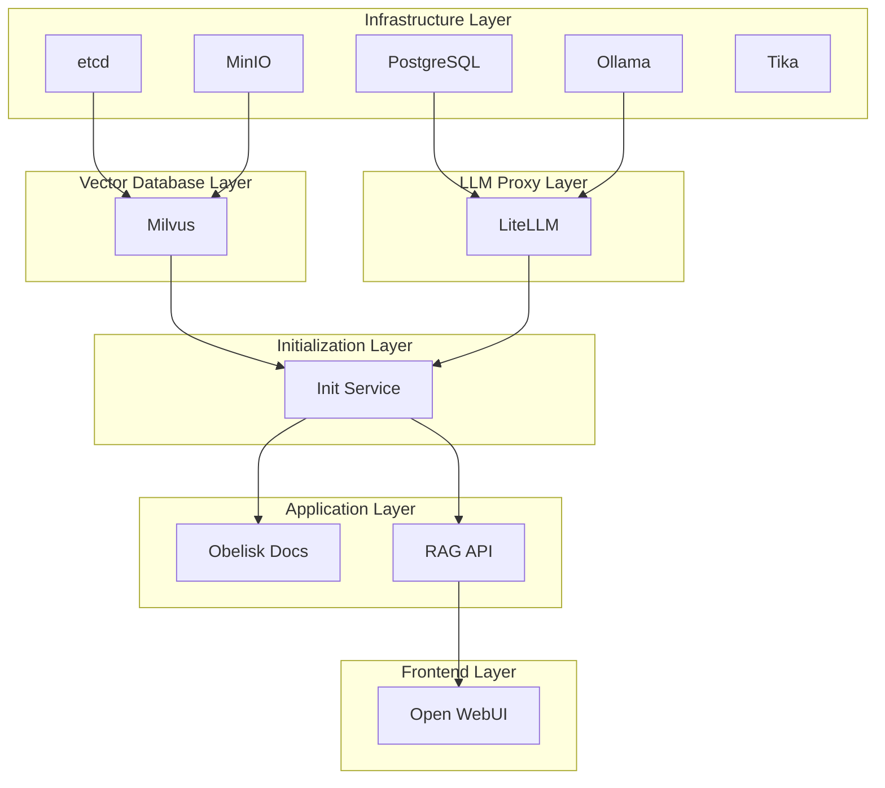

# Obelisk RAG Architecture

> **Version**: 0.1.0-alpha  
> **Status**: 🟡 Experimental  
> **Last Updated**: January 2025

## Overview

Obelisk is a RAG (Retrieval-Augmented Generation) system that transforms Obsidian vaults into AI-enhanced documentation sites. This document describes the current architecture following the ChromaDB → Milvus and Ollama → LiteLLM migration.

## Component Architecture

### Vector Storage Layer

**Implementation**: Milvus 2.5.10  
**Source**: `src/obelisk/rag/storage/store.py`

#### Key Features
- 3072-dimensional embeddings (text-embedding-3-large)
- HNSW indexing: M=16, efConstruction=256
- Collection: "obelisk_rag" with JSON metadata support
- Dependencies: etcd v3.5.21 for metadata, MinIO for object storage

#### Schema Definition
```python
fields = [
    FieldSchema(name="id", dtype=DataType.VARCHAR, is_primary=True, max_length=65535),
    FieldSchema(name="embedding", dtype=DataType.FLOAT_VECTOR, dim=3072),
    FieldSchema(name="content", dtype=DataType.VARCHAR, max_length=65535),
    FieldSchema(name="metadata", dtype=DataType.JSON),
    FieldSchema(name="doc_id", dtype=DataType.VARCHAR, max_length=255)
]
```

### Model Provider Layer

**Pattern**: Factory pattern with provider abstraction  
**Source**: `src/obelisk/rag/common/providers.py`

#### Provider Architecture
- **Base**: ModelProvider abstract class
- **Implementations**: 
  - LiteLLMProvider (default)
  - OllamaProvider (hardware tuning)
  - OpenAIProvider (direct access)
- **Factory**: `ProviderFactory.create(provider_type, config)`
- **Default**: LiteLLM at http://litellm:4000

#### Provider Selection Logic
```python
# Default: everything through LiteLLM
provider_type = ProviderType.LITELLM

# Special case: direct Ollama for hardware tuning
if x_provider_override and x_provider_override.lower() == "ollama":
    provider_type = ProviderType.OLLAMA
```

### API Layer

**Endpoint**: `/v1/chat/completions` (OpenAI-compatible)  
**Source**: `src/obelisk/rag/api/openai.py`  
**Authentication**: Bearer token (sk-prefixed)

#### Unified API Structure
- Single endpoint for all completions
- No more `/v1/litellm` or `/api/generate` endpoints
- X-Provider-Override header for direct provider access
- Token authentication with model-specific permissions

## Service Dependencies

### 6-Layer Startup Architecture



### Service Port Mapping

| Service | Internal Port | External Port | Description |
|---------|---------------|---------------|-------------|
| obelisk | 8000 | 8000 | MkDocs documentation |
| obelisk-rag | 8001 | 8001 | RAG API endpoint |
| litellm | 4000 | 4000 | LiteLLM proxy API |
| ollama | 11434 | 11434 | Ollama API |
| milvus | 19530 | 19530 | Milvus vector DB |
| open-webui | 8080 | 8080 | Chat interface |

## Configuration

### Environment Variables

```bash
# Vector Storage
MILVUS_HOST=milvus
MILVUS_PORT=19530
MILVUS_COLLECTION=obelisk_rag
MILVUS_USER=default
MILVUS_PASSWORD=Milvus

# LiteLLM Configuration
LITELLM_API_BASE=http://litellm:4000
LITELLM_API_KEY=<generated-token>
MODEL_PROVIDER=litellm
FORCE_LITELLM_PROXY=true

# Model Selection
EMBEDDING_MODEL=text-embedding-3-large
LLM_MODEL=gpt-4o

# Auto-indexing Control
AUTO_INDEX_ON_START=false
```

## Implementation Verification

### Pre-flight Checks
```bash
# Verify Milvus implementation
grep -r "ChromaDB\|Chroma" src/ --include="*.py" | wc -l  # Should be 0
grep -r "Milvus\|pymilvus" src/ --include="*.py" | wc -l  # Should be > 0

# Verify provider architecture
test -f src/obelisk/rag/common/providers.py && echo "✅ Provider factory exists"
grep -n "class.*Provider" src/obelisk/rag/common/providers.py

# Verify unified API endpoint
grep -n "/v1/chat/completions" src/obelisk/rag/api/openai.py
```

### Docker Stack Validation
```bash
# Layer 1: Infrastructure
docker-compose -f deployments/docker/compose/dev.yaml ps etcd minio litellm_db

# Layer 2: Vector Database  
docker exec milvus-etcd etcdctl endpoint health
curl -I http://localhost:9000/minio/health/live

# Layer 3: LiteLLM
curl http://localhost:4000/health

# Layer 4: Init Service
docker logs init-service | grep "Token file created successfully"
```

## Key Architecture Decisions

### Why Milvus?
- Production-ready vector database
- HNSW indexing for performance at scale
- Supports 3072-dimensional embeddings
- Built-in distributed architecture

### Why LiteLLM Proxy?
- Unified API for 100+ LLM providers
- Automatic retry and fallback
- Token-based authentication
- Model routing flexibility

### Why Provider Factory Pattern?
- Clean abstraction over LLM providers
- Easy to add new providers
- Allows provider-specific optimizations
- Maintains backward compatibility

## RAG Pipeline Flow

1. **Document Ingestion**
   - Parse markdown files from vault
   - Extract YAML frontmatter
   - Chunk hierarchically by headers

2. **Embedding Generation**
   - Use text-embedding-3-large (3072 dims)
   - Route through LiteLLM by default
   - Cache embeddings for performance

3. **Vector Storage**
   - Store in Milvus with metadata
   - HNSW index for fast retrieval
   - Inner product similarity metric

4. **Query Processing**
   - Embed query using same model
   - Retrieve top-k documents (default: 5)
   - Assemble context for LLM

5. **Response Generation**
   - Send context + query to LLM
   - Stream responses if requested
   - Return OpenAI-compatible format

## Monitoring and Debugging

### Health Checks
```bash
# Check all services
curl http://localhost:8001/health  # RAG API
curl http://localhost:4000/health  # LiteLLM
curl http://localhost:19530/v1/vector/collections  # Milvus

# Check document count
curl http://localhost:8001/stats
```

### Common Issues

**Milvus Connection Failed**
- Ensure etcd and MinIO are running first
- Wait 10-15 seconds for initialization
- Check: `docker-compose logs milvus`

**Token Authentication Failed**
- Regenerate: `docker-compose restart init-service`
- Get token: `docker exec litellm cat /app/tokens/api_tokens.env`

**No Documents Found**
- Check vault directory mounting
- Verify AUTO_INDEX_ON_START setting
- Manual index: `docker exec obelisk-rag obelisk rag index --vault /app/vault`