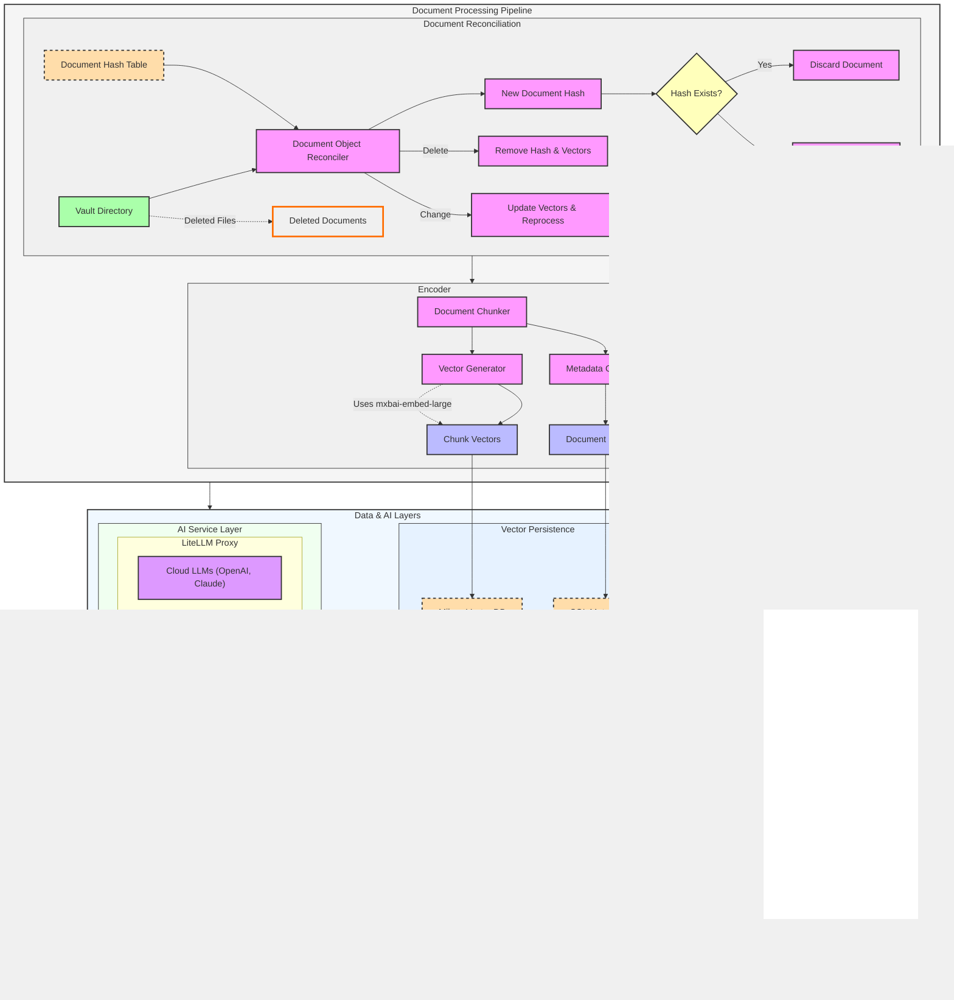

# System Architecture

This page contains a comprehensive architecture diagram for the Obelisk system, showing how all components interact from the document processing pipeline through to the client applications.

## Full Architecture Diagram

## Component Descriptions

### Document Processing Pipeline

The foundation of the Obelisk RAG system is the document processing pipeline, which handles:

#### Document Reconciliation
- **Vault Directory**: Source of markdown documents from the Obsidian vault
- **Document Object Reconciler**: Determines which documents need processing based on changes
- **Hash Table**: Stores document hashes to detect changes
- **Change Detection**: Identifies new, modified, and deleted documents

#### Embedding Generation
- **Document Chunker**: Breaks documents into semantic chunks for better retrieval
- **Metadata Generator**: Extracts and creates metadata for each document and chunk
- **Vector Generator**: Creates embeddings using mxbai-embed-large model
- **Chunk Vectors**: The embedded vector representations of document chunks

### Data & AI Layers

The middle layers provide data persistence and AI model access:

#### Vector Persistence
- **SQL Metadata DB**: Stores document metadata and relationships
- **Milvus Vector DB**: High-performance vector database for semantic search

#### AI Service Layer
- **LiteLLM Proxy**: Unified interface to multiple LLM providers
  - **Cloud LLMs**: Access to OpenAI and Anthropic Claude models
  - **Local LLMs**: Integration with Ollama for running Llama 3, Phi-4, etc.

### Integration & Client Layers

The user-facing components of the system:

#### MCP Integration
- **Obelisk RAG API**: REST API for accessing RAG capabilities
- **MCP Server**: Model Control Protocol server for standardized AI interaction

#### Client Applications
- **OpenWebUI**: Web-based chat interface with direct RAG integration
- **MCP Clients**: Desktop and IDE clients that connect via the MCP protocol

## Data Flow

1. **Document Ingestion**: The system monitors the Vault Directory for changes, creating hash values for each document
2. **Document Processing**: Changed documents are chunked, embedded, and stored in the vector database
3. **Storage**: Document metadata is stored in SQL, while vector embeddings are stored in Milvus
4. **Query Processing**: When a user query arrives, relevant documents are retrieved from vector storage
5. **LLM Enhancement**: Retrieved documents are used to enhance prompts sent to LLM models
6. **Client Delivery**: Responses are delivered through either OpenWebUI or MCP-compatible clients

## Integration Points

The architecture supports multiple integration pathways:

1. **Direct OpenWebUI Path**: For web-based chat interface users
2. **MCP Protocol Path**: For desktop applications and IDE integrations
3. **API Access**: For custom integrations with the Obelisk RAG capability

For detailed implementation guidance, see the [RAG Implementation Guide](rag/implementation.md) and [Using RAG](rag/using-rag.md) sections.