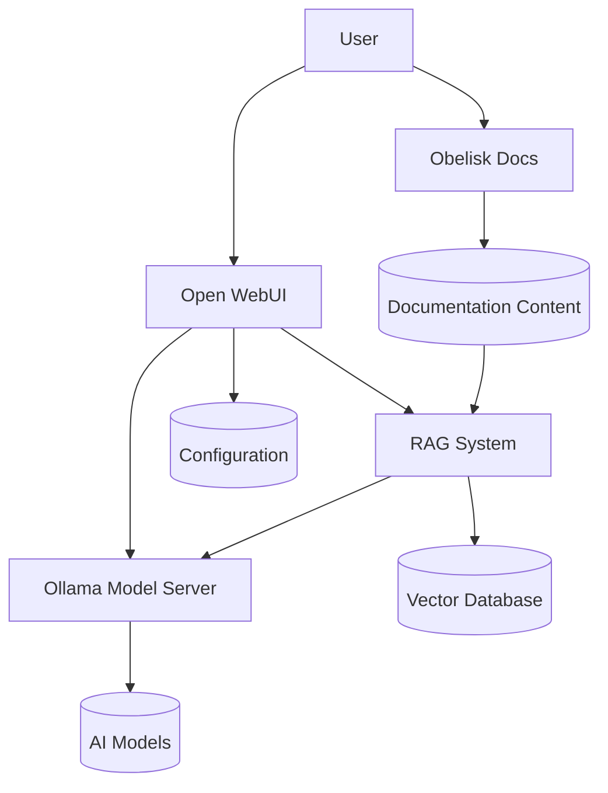

# Chatbot Integration

Obelisk includes integration with Ollama and Open WebUI to provide AI-powered chat capabilities directly within your documentation site. This section describes how to set up and use these features.

## Overview

The chatbot integration consists of three key components:

1. **Ollama**: A lightweight, local AI model server that runs models like Llama2, Mistral, and others.
2. **Open WebUI**: A web interface for interacting with the AI models served by Ollama.
3. **RAG System**: A Retrieval Augmented Generation system that enhances responses with content from your documentation.

Together, these services provide a complete AI chat experience that is directly connected to your documentation content, providing accurate, contextually relevant answers.

## How It Works

The chatbot integration uses Docker Compose to orchestrate the services:



For a comprehensive view of all components and their interactions, see the [complete architecture diagram](architecture.md).

1. Users interact with the Open WebUI interface at `http://localhost:8080`
2. Queries can be processed either directly by Ollama or through the RAG system
3. When using RAG, the system retrieves relevant content from your documentation
4. Ollama loads and runs AI models to generate responses enhanced with your content
5. The Obelisk documentation server runs independently at `http://localhost:8000`

## Services Configuration

### Ollama Service

The Ollama service runs the model server with GPU acceleration:

```yaml
ollama:
  container_name: ollama
  image: ollama/ollama:latest
  runtime: nvidia
  environment:
    - NVIDIA_VISIBLE_DEVICES=all
    - NVIDIA_DRIVER_CAPABILITIES=compute,utility
    - CUDA_VISIBLE_DEVICES=0
    - LOG_LEVEL=debug
  deploy:
    resources:
      reservations:
        devices:
          - driver: nvidia
            capabilities: [gpu]
            count: all
  volumes:
    - ollama:/root/.ollama
    - models:/models
  ports:
    - "11434:11434"
  networks:
    - ollama-net
  restart: unless-stopped
```

### Open WebUI Service

The Open WebUI service provides the chat interface:

```yaml
open-webui:
  container_name: open-webui
  image: ghcr.io/open-webui/open-webui:main
  environment:
    - MODEL_DOWNLOAD_DIR=/models
    - OLLAMA_API_BASE_URL=http://ollama:11434
    - OLLAMA_API_URL=http://ollama:11434
    - LOG_LEVEL=debug
  volumes:
    - data:/data
    - models:/models
    - open-webui:/config
  ports:
    - "8080:8080"
  depends_on:
    - ollama
  networks:
    - ollama-net
  restart: unless-stopped
```

## Getting Started

To start using the chatbot integration:

1. Ensure you have [Docker](https://docs.docker.com/get-docker/) and [Docker Compose](https://docs.docker.com/compose/install/) installed
2. For GPU acceleration, install the [NVIDIA Container Toolkit](https://docs.nvidia.com/datacenter/cloud-native/container-toolkit/install-guide.html)
3. Start the full stack:

```bash
task compose
```

4. Access the chat interface at `http://localhost:8080`
5. Access your documentation at `http://localhost:8000`

## Available Models

By default, no models are pre-loaded. You can pull models through the Open WebUI interface or directly via Ollama commands:

```bash
# Connect to the Ollama container
docker exec -it ollama bash

# Pull a model (example: mistral)
ollama pull mistral
```

Popular models to consider:

- `llama2` - Meta's Llama 2 model
- `mistral` - Mistral AI's 7B model
- `phi` - Microsoft's Phi model
- `gemma` - Google's Gemma model

## Customizing the Chat Experience

You can customize the chat experience by:

1. Configuring Open WebUI settings through the interface
2. Creating custom model configurations
3. Using the RAG system to enhance responses with your documentation
4. Customizing the RAG system parameters for better retrieval

See the [Open WebUI documentation](https://github.com/open-webui/open-webui), [Ollama documentation](https://github.com/ollama/ollama), and our [RAG documentation](rag/getting-started.md) for more details.

## RAG System Integration

The Retrieval Augmented Generation (RAG) system enhances your chatbot with knowledge from your documentation:

1. **Index your documentation**:
   ```bash
   obelisk-rag index
   ```

2. **Start the RAG API server**:
   ```bash
   obelisk-rag serve --watch
   ```

3. **In Open WebUI, add a new API-based model**:
   - Name: "Obelisk RAG"
   - Base URL: "http://localhost:8000"
   - API Path: "/query"
   - Request Format: `{"query": "{prompt}"}`
   - Response Path: "response"

For detailed instructions on setting up and using the RAG system, see the [RAG Getting Started Guide](rag/getting-started.md) and [Using RAG](rag/using-rag.md).