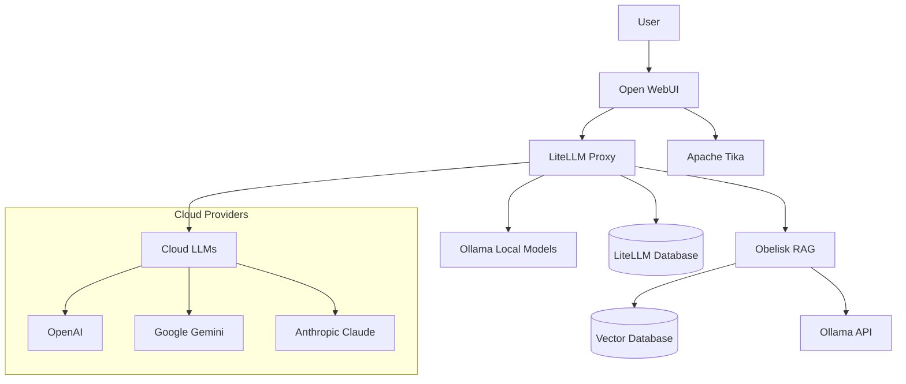

# LiteLLM Proxy Integration

Obelisk includes integration with LiteLLM proxy to provide access to multiple AI model providers through a single, standardized interface. This integration enhances the capabilities of the chatbot system while maintaining compatibility with the existing Obelisk RAG pipeline.

## Overview

The LiteLLM proxy serves as a middleware layer between OpenWebUI and various LLM providers, offering:

1. **Unified API Access**: Connect to 100+ AI models through a single API endpoint
2. **API Key Management**: Securely manage access credentials for different providers
3. **Usage Tracking**: Monitor API usage and implement budget controls
4. **Routing Logic**: Direct requests to the most appropriate model based on configuration
5. **Compatibility**: Maintain existing Obelisk RAG functionality while adding new capabilities

## Architecture Integration



## Components

### LiteLLM Proxy

The LiteLLM proxy is the central component of this integration:

- **Image**: `ghcr.io/berriai/litellm:main-latest`
- **Configuration**: `litellm-config.yaml`
- **Purpose**: Routes API requests to the appropriate model provider

### PostgreSQL Database

Stores configuration and usage data for the LiteLLM proxy:

- **Image**: `postgres:16.1`
- **Purpose**: Persistent storage for API keys, usage logs, and model configurations

### Apache Tika

Document processing service for OpenWebUI's built-in RAG capabilities:

- **Image**: `apache/tika:latest-full`
- **Purpose**: Extract and process content from various document formats

## Configuration

### Environment Variables

Create a `.env` file based on the provided `.env.example` template with:

```
# Required settings
LITELLM_MASTER_KEY=your-master-key
LITELLM_VIRTUAL_KEY=your-virtual-key

# API keys for specific providers (as needed)
OPENAI_API_KEY=your-openai-key
GEMINI_API_KEY=your-gemini-key
```

### Model Configuration

The `litellm-config.yaml` file defines available models and routing logic:

```yaml
model_list:
  - model_name: ollama/llama3
    litellm_params:
      model: ollama/llama3
      api_base: http://ollama:11434

  - model_name: obelisk-rag/llama3
    litellm_params:
      model: openai/gpt-3.5-turbo  # Placeholder
      api_base: http://obelisk-rag:8000
      
  # Additional cloud models as needed
```

## Using Multiple Model Providers

With this integration, you can:

1. **Use Local Models**: Access Ollama models running locally
2. **Access Obelisk RAG**: Continue using the Obelisk RAG pipeline for document-enriched responses
3. **Connect to Cloud Services**: Add OpenAI, Gemini, Claude, and other providers

### Adding a New Provider

To add a new model provider:

1. Add the appropriate API key to your `.env` file
2. Add the model configuration to `litellm-config.yaml`
3. Restart the containers with `docker-compose up -d`

Example for adding Anthropic Claude:

```yaml
# In litellm-config.yaml
model_list:
  # Existing models...
  
  - model_name: anthropic/claude-3-opus
    litellm_params:
      model: anthropic/claude-3-opus
      api_key: os.environ/ANTHROPIC_API_KEY
      drop_params: true
```

## Switching Between Modes

The system is configured to allow flexible use of different capabilities:

1. **Obelisk RAG**: Access document-aware responses through the `obelisk-rag/llama3` model
2. **Direct Ollama**: Use local models directly via the `ollama/llama3` model
3. **Cloud Models**: Access providers like OpenAI via their respective models

## Admin Interface

LiteLLM provides an admin interface available at `http://localhost:4000/dashboard` for:

- Monitoring usage
- Managing API keys
- Viewing logs
- Adding/configuring models

Access requires the master key defined in your environment variables.

## Compatibility Notes

This integration maintains backward compatibility with the existing Obelisk RAG system:

- All existing RAG capabilities continue to function
- Existing documents and vector databases are preserved
- The middleware layer adds capabilities without removing functionality

## Troubleshooting

### Common Issues

1. **Connection errors**: 
   - Verify network connectivity between containers
   - Check that all services are running with `docker-compose ps`

2. **Authentication failures**:
   - Verify API keys in the `.env` file
   - Check that LiteLLM is correctly loading environment variables

3. **Model not found errors**:
   - Ensure the model is correctly configured in `litellm-config.yaml`
   - Check that the model provider's API is accessible

### Viewing Logs

To view logs for debugging:

```bash
# LiteLLM proxy logs
docker-compose logs -f litellm

# Database logs
docker-compose logs -f litellm_db

# OpenWebUI logs
docker-compose logs -f open-webui
```