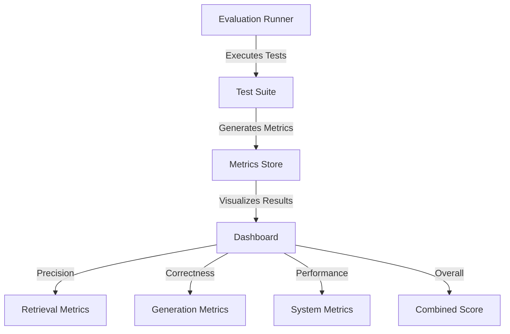

# RAG Pipeline Evaluation

This page outlines how to evaluate and optimize the performance of the Obelisk RAG system.

## Evaluation Metrics

The RAG pipeline will be evaluated using several key metrics:

### Retrieval Metrics

- **Precision@k**: Proportion of relevant documents in the top k results
- **Recall@k**: Proportion of all relevant documents that appear in the top k
- **Mean Reciprocal Rank (MRR)**: Average position of the first relevant document
- **Normalized Discounted Cumulative Gain (NDCG)**: Measures ranking quality

### Generation Metrics

- **Answer Relevance**: How relevant the answer is to the question
- **Factual Correctness**: Whether the answer contains factual errors
- **Hallucination Rate**: Proportion of generated content not supported by context
- **Citation Accuracy**: Whether sources are accurately cited
- **Completeness**: Whether the answer fully addresses the question

### System Metrics

- **Latency**: End-to-end response time
- **Token Efficiency**: Number of tokens used vs. information conveyed
- **Resource Usage**: Memory and CPU consumption
- **Throughput**: Queries processed per second

## Evaluation Framework

The RAG pipeline will include a built-in evaluation framework:

```python
# Future implementation example
class RAGEvaluator:
    def __init__(self, config):
        self.config = config
        self.test_cases = self._load_test_cases()
        
    def _load_test_cases(self):
        """Load test cases from configuration."""
        # Implementation details
        
    def evaluate_retrieval(self, query_processor):
        """Evaluate retrieval performance."""
        results = {}
        
        for test_case in self.test_cases:
            query = test_case["query"]
            relevant_docs = test_case["relevant_docs"]
            
            retrieved = query_processor.process_query(query)
            retrieved_ids = [doc["id"] for doc in retrieved["retrieved_chunks"]]
            
            results[query] = {
                "precision": self._calculate_precision(retrieved_ids, relevant_docs),
                "recall": self._calculate_recall(retrieved_ids, relevant_docs),
                "mrr": self._calculate_mrr(retrieved_ids, relevant_docs),
                "ndcg": self._calculate_ndcg(retrieved_ids, relevant_docs)
            }
            
        return results
        
    def evaluate_generation(self, rag_pipeline):
        """Evaluate generation quality."""
        # Implementation details
        
    def evaluate_system(self, rag_pipeline):
        """Evaluate system performance."""
        # Implementation details
        
    def generate_report(self, results):
        """Generate evaluation report."""
        # Implementation details
```

## Synthetic Test Suite

The evaluation framework will include a synthetic test suite:

1. **Query Generation**: Generate realistic user queries
2. **Expected Answer Creation**: Create expected answers
3. **Document Tagging**: Tag documents for relevance
4. **Test Case Assembly**: Create complete test cases

Example test case:

```json
{
  "query": "How do I configure the Ollama service in Docker?",
  "query_type": "how-to",
  "relevant_docs": [
    "development/docker.md#ollama-service",
    "chatbot/index.md#services-configuration"
  ],
  "expected_answer_elements": [
    "Ollama service configuration in docker-compose.yaml",
    "Environment variables for GPU acceleration",
    "Volume mounts for model storage"
  ],
  "difficulty": "medium"
}
```

## Human Evaluation

In addition to automated metrics, human evaluation will be critical:

1. **Side-by-side comparisons**: Compare RAG vs. non-RAG responses
2. **Blind evaluation**: Rate responses without knowing the source
3. **Expert review**: Domain experts evaluate factual correctness
4. **User feedback collection**: Gather feedback from real users

## Evaluation Dashboard

The RAG pipeline will include a visual dashboard for evaluation:



## Continuous Improvement

The evaluation system will enable continuous improvement:

### Error Analysis

Categorizing and tracking error types:

- **Retrieval failures**: Relevant content not retrieved
- **Context utilization errors**: Context ignored or misinterpreted
- **Hallucination instances**: Information not grounded in context
- **Citation errors**: Missing or incorrect citations

### Optimization Process

A systematic approach to RAG optimization:

1. **Baseline establishment**: Measure initial performance
2. **Component isolation**: Test each component independently
3. **Ablation studies**: Remove components to measure impact
4. **Parameter tuning**: Optimize configuration parameters
5. **A/B testing**: Compare variations with real users

## Implementation Roadmap

The evaluation system will be implemented in phases:

| Phase | Feature | Description |
|-------|---------|-------------|
| 1 | Basic Metrics | Implement core precision/recall metrics |
| 2 | Automated Test Suite | Create synthetic test cases |
| 3 | Human Evaluation Tools | Build tools for human feedback |
| 4 | Dashboard | Create visualization dashboard |
| 5 | Continuous Monitoring | Implement ongoing evaluation |

## Best Practices

Recommendations for effective RAG evaluation:

1. **Diverse test cases**: Include varied query types and difficulty levels
2. **Regular re-evaluation**: Test after each significant change
3. **User-focused metrics**: Prioritize metrics aligned with user satisfaction
4. **Documentation-specific evaluation**: Create tests specific to documentation use cases
5. **Comparative analysis**: Benchmark against similar systems