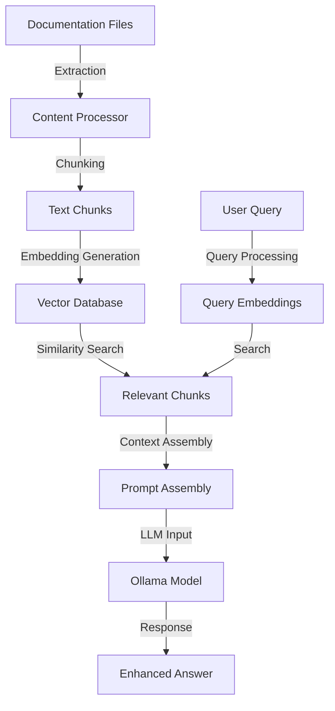

# Getting Started with Obelisk RAG

This guide will help you get started with the Retrieval Augmented Generation (RAG) system in Obelisk. We'll walk through the process of setting up your environment, initializing the system, and making your first query.

## What is RAG?

Retrieval Augmented Generation (RAG) is a technique that enhances Large Language Models (LLMs) by providing them with relevant information retrieved from a knowledge base before generating responses. This approach combines the strengths of:

1. **Retrieval systems** - Finding relevant content from your knowledge base
2. **Generation capabilities** - Using that content to produce accurate, contextual responses

For Obelisk, this means the AI chatbot will be able to answer questions based specifically on your documentation content.

## RAG Architecture

The Obelisk RAG pipeline consists of several key components:



The RAG pipeline follows these steps:
1. **Content Processing**: Extract content from Markdown files in your Obsidian vault
2. **Chunking**: Split content into appropriate segments for embedding
3. **Embedding Generation**: Convert text chunks into vector embeddings
4. **Vector Storage**: Store embeddings in a vector database for efficient retrieval
5. **Query Processing**: Process and embed user queries
6. **Retrieval**: Find the most relevant document chunks
7. **Context Assembly**: Combine retrieved content into a prompt
8. **Response Generation**: Generate accurate responses based on retrieved content

## Implementation Status

The RAG pipeline has been implemented with the following components:

| Phase | Feature | Status |
|-------|---------|--------|
| 1 | Document Processing Pipeline | Completed ✓ |
| 2 | Vector Database Integration | Completed ✓ |
| 3 | Query Processing & Retrieval | Completed ✓ |
| 4 | Integration with Ollama | Completed ✓ |
| 5 | Web UI Extensions | Planned |

## Prerequisites

Before you start, ensure you have:

1. **Obelisk installed**: The RAG system is part of Obelisk
2. **Ollama running**: The system requires Ollama for LLMs and embeddings
3. **Documentation in your vault**: Some markdown files to index

## Step 1: Start Ollama

The RAG system requires Ollama for generating embeddings and providing LLM capabilities. You can run Ollama using Docker:

```bash
docker-compose up ollama -d
```

Wait for Ollama to start up (this might take a minute).

## Step 2: Pull Required Models

The RAG system needs models for embedding generation and text generation. You can pull them using:

```bash
# Pull the LLM model (llama3 is recommended)
docker exec -it ollama ollama pull llama3

# Pull the embedding model
docker exec -it ollama ollama pull mxbai-embed-large
```

This step will download the required models. The embedding model is optimized for generating high-quality embeddings for document retrieval.

## Step 3: Configure the RAG System

The default configuration should work for most users, but you can customize it if needed:

```bash
# View current configuration
obelisk-rag config --show

# Set a different vault directory if needed
obelisk-rag config --set "vault_dir=/path/to/your/docs"

# Set different Ollama URL if needed
obelisk-rag config --set "ollama_url=http://ollama:11434"
```

## Step 4: Index Your Documentation

Before you can query your documentation, you need to index it:

```bash
obelisk-rag index
```

This process will:
1. Read all markdown files in your vault
2. Extract the content and metadata
3. Split the content into chunks
4. Generate embeddings for each chunk
5. Store everything in a vector database

You should see a progress report in the console as files are processed.

## Step 5: Make Your First Query

Now you can query your documentation:

```bash
obelisk-rag query "What is Obelisk?"
```

The system will:
1. Convert your query to an embedding
2. Find the most relevant document chunks
3. Use those chunks as context for the LLM
4. Generate a response based on your documentation

You should see a response that's specifically informed by your documentation.

## Step 6: Start the API Server (Optional)

If you want to integrate with other applications or want the real-time document watching feature, you can start the API server:

```bash
obelisk-rag serve --watch
```

This will:
1. Start a REST API server (default: http://0.0.0.0:8000)
2. Provide endpoints for querying and stats
3. Watch for changes to documentation files and update the index automatically

## Troubleshooting

### Common Issues

1. **Connection errors with Ollama**:
   
   ```
   Error: Failed to connect to Ollama service at http://localhost:11434
   ```
   
   Ensure Ollama is running and accessible at the configured URL. You may need to adjust the URL with:
   
   ```bash
   obelisk-rag config --set "ollama_url=http://ollama:11434"
   ```

2. **No results when querying**:
   
   ```
   No documents found for query: What is Obelisk?
   ```
   
   Check that your documentation has been indexed successfully. Run `obelisk-rag stats` to see how many documents are in the database.

3. **Model not found errors**:
   
   ```
   Error: Model 'llama3' not found
   ```
   
   Ensure you have pulled the required models using Ollama.

### Enabling Debug Mode

If you're encountering issues, you can enable debug mode for more detailed logs:

```bash
export RAG_DEBUG=1
obelisk-rag query "What is Obelisk?"
```

## Next Steps

Now that you have the RAG system up and running, you can:

1. Learn about [advanced configuration options](using-rag.md)
2. Integrate with [Open WebUI](../openwebui.md) for a chat interface
3. View the [complete system architecture diagram](../architecture.md)
4. Explore the [RAG architecture details](architecture-draft.md) in depth
5. Read about the [implementation details](implementation.md) if you want to customize the system
6. Review [evaluation techniques](evaluation.md) to measure and improve performance

---

For more detailed usage information, see [Using the RAG System](using-rag.md).