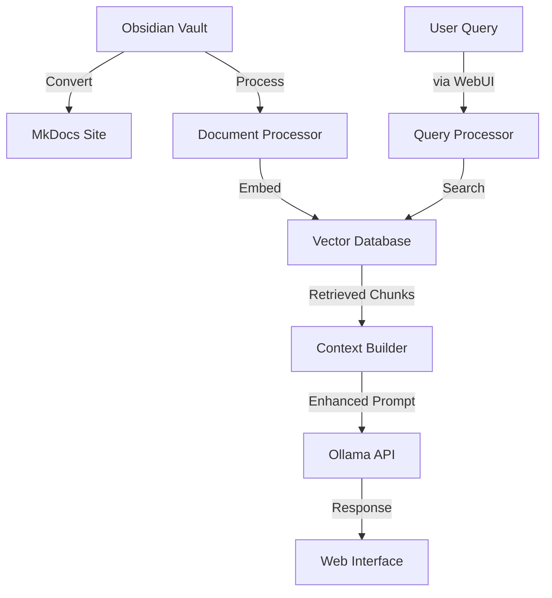

# Implementation Guide

This guide provides details on the RAG implementation in Obelisk, covering both the current implementation and future development considerations.

## Architecture Integration

The RAG pipeline will be integrated into Obelisk's architecture:



## Core Components

> Note: The following sections include both currently implemented features and future planned enhancements. The code examples marked "Current implementation" reflect the actual implemented code, while examples marked "Future implementation" represent planned features.

### 1. Document Processor

Responsible for parsing Markdown files, chunking content, and handling metadata:

```python
# Current implementation
class DocumentProcessor:
    def __init__(self, config):
        """Initialize the document processor."""
        self.config = config
        # RecursiveCharacterTextSplitter is used for intelligent document chunking
        self.text_splitter = RecursiveCharacterTextSplitter(
            # These values come from configuration
            chunk_size=config.get("chunk_size"),
            chunk_overlap=config.get("chunk_overlap"),
            # Separators define how text is split, prioritizing Markdown headers
            # to ensure chunks maintain semantic relevance
            separators=["\n## ", "\n### ", "\n#### ", "\n", " ", ""]
        )
        
        # References to other services (set via register_services)
        self.embedding_service = None
        self.storage_service = None
    
    def process_file(self, file_path):
        """Process a single markdown file."""
        # Read file and create document with source metadata
        with open(file_path, 'r', encoding='utf-8') as f:
            content = f.read()
        
        doc = Document(
            page_content=content,
            metadata={"source": file_path}
        )
        
        # Extract YAML frontmatter as metadata
        self._extract_metadata(doc)
        
        # Split document into chunks
        chunks = self.text_splitter.split_documents([doc])
        
        # Process with embedding and storage services if available
        if self.embedding_service and self.storage_service:
            embedded_docs = self.embedding_service.embed_documents(chunks)
            self.storage_service.add_documents(embedded_docs)
        
        return chunks
    
    def process_directory(self, directory=None):
        """Process all markdown files in a directory recursively."""
        directory = directory or self.config.get("vault_dir")
        all_chunks = []
        
        # Use glob to find all markdown files
        for md_file in glob.glob(f"{directory}/**/*.md", recursive=True):
            chunks = self.process_file(md_file)
            all_chunks.extend(chunks)
        
        return all_chunks
```

#### Document Chunking Details

The document chunking process uses LangChain's `RecursiveCharacterTextSplitter`, which:

1. Starts with the most granular separator (`\n## ` - Markdown h2 headers)
2. If chunks are still too large, proceeds to the next separator (h3, h4, etc.)
3. Ultimately splits on individual characters if necessary
4. Maintains overlap between chunks to preserve context across chunk boundaries

This approach ensures chunks align with semantic boundaries when possible, improving retrieval quality by keeping related content together.

#### Configuration Options

Document chunking can be configured with:

| Parameter | Description | Default |
|-----------|-------------|---------|
| `chunk_size` | Target size of each chunk in characters | 1000 |
| `chunk_overlap` | Number of characters to overlap between chunks | 200 |

These parameters balance:
- **Larger chunks**: More context but less precise retrieval
- **Smaller chunks**: More precise retrieval but less context
- **Chunk overlap**: Ensures information spanning chunk boundaries isn't lost

The document processor also includes real-time file watching capabilities using the `watchdog` library to detect changes to markdown files and automatically update the vector database.

### 2. Vector Database Manager

Interface for vector database operations:

```python
# Future implementation example
class VectorDBManager:
    def __init__(self, config):
        self.config = config
        self.db = self._initialize_db()
        
    def _initialize_db(self):
        """Initialize the vector database based on configuration."""
        db_type = self.config.get("vector_db", "chroma")
        if db_type == "chroma":
            return self._init_chroma()
        elif db_type == "faiss":
            return self._init_faiss()
        # Other implementations
        
    def add_documents(self, chunks, embeddings, metadata):
        """Add document chunks to the database."""
        # Implementation details
        
    def search(self, query_embedding, filters=None, k=5):
        """Search for similar documents."""
        # Implementation details
        
    def update_document(self, doc_id, new_embedding=None, new_metadata=None):
        """Update an existing document."""
        # Implementation details
        
    def delete_document(self, doc_id):
        """Remove a document from the database."""
        # Implementation details
```

### 3. Query Processor

Handles user queries and retrieval:

```python
# Future implementation example
class QueryProcessor:
    def __init__(self, vector_db, embedding_model, config):
        self.vector_db = vector_db
        self.embedding_model = embedding_model
        self.config = config
        
    async def process_query(self, query_text):
        """Process a user query and retrieve relevant context."""
        # Preprocess query
        processed_query = self._preprocess_query(query_text)
        
        # Generate embedding
        query_embedding = self.embedding_model.embed(processed_query)
        
        # Retrieve relevant chunks
        results = self.vector_db.search(
            query_embedding,
            filters=processed_query.get("filters"),
            k=self.config.get("retrieve_top_k", 5)
        )
        
        # Assemble context
        context = self._assemble_context(results)
        
        return {
            "original_query": query_text,
            "processed_query": processed_query,
            "retrieved_chunks": results,
            "assembled_context": context
        }
```

### 4. Prompt Manager

Handles prompt assembly and model interaction:

```python
# Future implementation example
class PromptManager:
    def __init__(self, config):
        self.config = config
        self.templates = self._load_templates()
        
    def _load_templates(self):
        """Load prompt templates from configuration."""
        # Implementation details
        
    def create_prompt(self, query, context):
        """Create a prompt with retrieved context."""
        template = self.templates.get("default_rag")
        return template.format(
            retrieved_context=self._format_context(context),
            user_question=query["original_query"]
        )
        
    def _format_context(self, context_items):
        """Format retrieved context items for the prompt."""
        # Implementation details
```

## Integration with Ollama

The RAG pipeline integrates with Ollama for both embedding generation and LLM response generation:

```python
# Current implementation (simplified)
from langchain_ollama import ChatOllama
from langchain_ollama import OllamaEmbeddings

class EmbeddingService:
    def __init__(self, config):
        """Initialize the embedding service."""
        self.config = config
        self.embedding_model = OllamaEmbeddings(
            model=config.get("embedding_model"),
            base_url=config.get("ollama_url")
        )
    
    def embed_documents(self, documents):
        """Generate embeddings for a list of documents."""
        try:
            # Current implementation processes each document individually
            # Future enhancement: Add batch processing for better performance
            # with documents processed in configurable batch sizes
            for doc in documents:
                doc.embedding = self.embedding_model.embed_query(doc.page_content)
            return documents
        except Exception as e:
            logger.error(f"Error embedding documents: {e}")
            return []

class RAGService:
    def __init__(self, config):
        """Initialize with all necessary components."""
        self.config = config
        self.llm = ChatOllama(
            model=config.get("ollama_model"),
            base_url=config.get("ollama_url"),
            temperature=0.7,
        )
    
    def query(self, query_text):
        """Process a query using RAG."""
        try:
            # Get relevant documents
            relevant_docs = self.storage_service.query(query_text)
            
            # Format prompt with context
            context = "\n\n".join([doc.page_content for doc in relevant_docs])
            prompt = f"""Use the following information to answer the question.
            
Information:
{context}

Question: {query_text}

Answer:"""
            
            # Get response from Ollama
            response = self.llm.invoke(prompt)
            
            return {
                "query": query_text,
                "response": response.content,
                "context": relevant_docs,
                "no_context": len(relevant_docs) == 0
            }
        except Exception as e:
            logger.error(f"Error processing query: {e}")
            # Fallback to direct LLM query
            response = self.llm.invoke(f"Question: {query_text}\n\nAnswer:")
            return {
                "query": query_text,
                "response": response.content,
                "context": [],
                "no_context": True
            }
```

## Error Handling Architecture

The RAG system implements a comprehensive error handling strategy to ensure reliability:

### 1. Layered Error Handling

Each component implements its own error handling appropriate to its context:

- **Document Processor**: Handles I/O errors, parsing errors, and invalid documents
- **Embedding Service**: Manages embedding generation failures
- **Vector Storage**: Handles database errors and metadata type compatibility
- **API Layer**: Converts exceptions to proper HTTP responses

### 2. Error Recovery Strategies

The system uses various strategies to recover from errors:

- **Graceful Degradation**: If document retrieval fails, the system falls back to direct LLM queries
- **Default Values**: Configuration system provides sensible defaults for all settings
- **Filtering**: Invalid documents or metadata are filtered rather than causing failures
- **Persistence**: Database operations include safeguards against corruption

### 3. Logging System

A centralized logging system provides visibility into errors:

```python
# Logging configuration (from cli.py)
logging.basicConfig(
    level=logging.INFO,
    format='%(asctime)s - %(name)s - %(levelname)s - %(message)s',
    handlers=[
        logging.StreamHandler()
    ]
)
# Specific logging for external libraries
logging.getLogger("httpx").setLevel(logging.WARNING)
logging.getLogger("chromadb").setLevel(logging.WARNING)
```

### 4. Debug Mode

A debug mode can be enabled for detailed error information:

```python
# Debug mode handling (from cli.py)
try:
    # Operation code
except Exception as e:
    logger.error(f"Error: {e}")
    if os.environ.get("RAG_DEBUG"):
        # In debug mode, show the full traceback
        import traceback
        traceback.print_exc()
    else:
        # In normal mode, show a user-friendly message
        print(f"Error: {e}")
        print("For detailed error output, set the RAG_DEBUG environment variable")
```

## Web UI Integration

Connection to the Open WebUI interface:

```python
# Future implementation example
class WebUIIntegration:
    def __init__(self, config):
        self.config = config
        
    def register_endpoints(self, app):
        """Register RAG endpoints with the web application."""
        app.add_route("/api/rag/query", self.handle_query)
        
    async def handle_query(self, request):
        """Handle RAG query requests."""
        # Implementation details
```

## Configuration System

RAG features will be configurable through MkDocs configuration:

```yaml
# Example future configuration
plugins:
  - obelisk-rag:
      # Document processing
      chunk_size: 512
      chunk_overlap: 50
      chunk_strategy: "fixed"  # fixed, semantic, recursive
      
      # Embedding
      embedding_model: "nomic-embed-text"
      embedding_dimension: 768
      
      # Vector database
      vector_db: "chroma"
      vector_db_path: "./.obelisk/vectordb"
      
      # Query processing
      retrieve_top_k: 5
      reranking_enabled: true
      hybrid_search: true
      
      # Integration
      ollama_url: "http://ollama:11434"
      ollama_model: "mistral"
      
      # Templates
      prompt_template: "default_rag"
      custom_templates:
        my_template: "path/to/template.txt"
```

## Deployment Considerations

### Resource Requirements

| Deployment Size | Documents | Vector DB Size | RAM | Storage |
|-----------------|-----------|----------------|-----|---------|
| Small (<100 docs) | <1,000 chunks | ~100MB | 2GB | 1GB |
| Medium (~500 docs) | ~5,000 chunks | ~500MB | 4GB | 5GB |
| Large (1000+ docs) | 10,000+ chunks | 1GB+ | 8GB+ | 10GB+ |

### Docker Configuration

Additional container configuration for RAG:

```yaml
# Future docker-compose additions
services:
  obelisk:
    # Existing configuration...
    environment:
      - OBELISK_RAG_ENABLED=true
      - OBELISK_VECTOR_DB_PATH=/data/vectordb
    volumes:
      - vectordb_data:/data/vectordb
      
volumes:
  vectordb_data:
```

## Monitoring and Maintenance

The RAG system will include:

1. **Embedding updates**: Trigger on content changes
2. **Index optimization**: Scheduled maintenance tasks
3. **Performance metrics**: Track latency and quality
4. **Usage statistics**: Monitor query patterns
5. **Content gap analysis**: Identify missing documentation