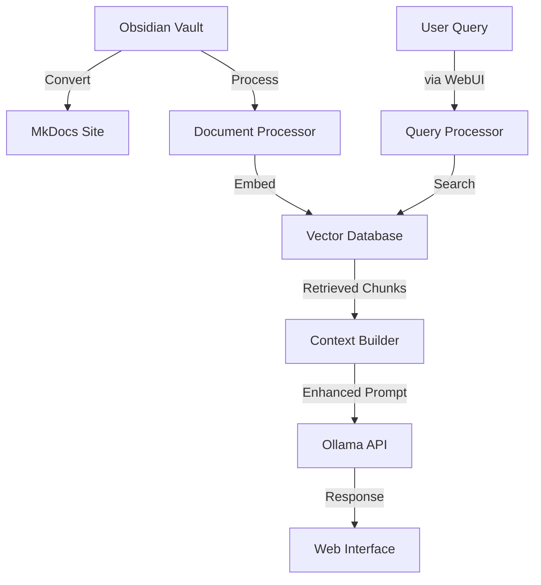

# Implementation Guide

This guide provides a roadmap for implementing the RAG pipeline in Obelisk, covering integration with the existing codebase and deployment considerations.

## Architecture Integration

The RAG pipeline will be integrated into Obelisk's architecture:



## Core Components

### 1. Document Processor

Responsible for parsing Markdown files and creating embeddings:

```python
# Future implementation example
class DocumentProcessor:
    def __init__(self, config):
        self.config = config
        self.embedding_model = self._load_embedding_model()
        
    def process_vault(self, vault_path):
        """Process all documents in the vault."""
        documents = self._collect_documents(vault_path)
        chunks = self._chunk_documents(documents)
        embeddings = self._create_embeddings(chunks)
        self._store_in_vectordb(chunks, embeddings)
        
    def _load_embedding_model(self):
        """Load the configured embedding model."""
        # Implementation details
        
    def _collect_documents(self, path):
        """Collect all markdown documents."""
        # Implementation details
        
    def _chunk_documents(self, documents):
        """Split documents into appropriate chunks."""
        # Implementation details
        
    def _create_embeddings(self, chunks):
        """Generate embeddings for all chunks."""
        # Implementation details
        
    def _store_in_vectordb(self, chunks, embeddings):
        """Store chunks and embeddings in vector database."""
        # Implementation details
```

### 2. Vector Database Manager

Interface for vector database operations:

```python
# Future implementation example
class VectorDBManager:
    def __init__(self, config):
        self.config = config
        self.db = self._initialize_db()
        
    def _initialize_db(self):
        """Initialize the vector database based on configuration."""
        db_type = self.config.get("vector_db", "chroma")
        if db_type == "chroma":
            return self._init_chroma()
        elif db_type == "faiss":
            return self._init_faiss()
        # Other implementations
        
    def add_documents(self, chunks, embeddings, metadata):
        """Add document chunks to the database."""
        # Implementation details
        
    def search(self, query_embedding, filters=None, k=5):
        """Search for similar documents."""
        # Implementation details
        
    def update_document(self, doc_id, new_embedding=None, new_metadata=None):
        """Update an existing document."""
        # Implementation details
        
    def delete_document(self, doc_id):
        """Remove a document from the database."""
        # Implementation details
```

### 3. Query Processor

Handles user queries and retrieval:

```python
# Future implementation example
class QueryProcessor:
    def __init__(self, vector_db, embedding_model, config):
        self.vector_db = vector_db
        self.embedding_model = embedding_model
        self.config = config
        
    async def process_query(self, query_text):
        """Process a user query and retrieve relevant context."""
        # Preprocess query
        processed_query = self._preprocess_query(query_text)
        
        # Generate embedding
        query_embedding = self.embedding_model.embed(processed_query)
        
        # Retrieve relevant chunks
        results = self.vector_db.search(
            query_embedding,
            filters=processed_query.get("filters"),
            k=self.config.get("retrieve_top_k", 5)
        )
        
        # Assemble context
        context = self._assemble_context(results)
        
        return {
            "original_query": query_text,
            "processed_query": processed_query,
            "retrieved_chunks": results,
            "assembled_context": context
        }
```

### 4. Prompt Manager

Handles prompt assembly and model interaction:

```python
# Future implementation example
class PromptManager:
    def __init__(self, config):
        self.config = config
        self.templates = self._load_templates()
        
    def _load_templates(self):
        """Load prompt templates from configuration."""
        # Implementation details
        
    def create_prompt(self, query, context):
        """Create a prompt with retrieved context."""
        template = self.templates.get("default_rag")
        return template.format(
            retrieved_context=self._format_context(context),
            user_question=query["original_query"]
        )
        
    def _format_context(self, context_items):
        """Format retrieved context items for the prompt."""
        # Implementation details
```

## Integration with Ollama

The RAG pipeline will integrate with Ollama:

```python
# Future implementation example
class OllamaIntegration:
    def __init__(self, config):
        self.api_base = config.get("ollama_api_url", "http://localhost:11434")
        self.model = config.get("ollama_model", "mistral")
        
    async def generate_response(self, prompt, params=None):
        """Generate a response from Ollama."""
        default_params = {
            "temperature": 0.7,
            "top_p": 0.9,
            "max_tokens": 1024
        }
        params = {**default_params, **(params or {})}
        
        async with aiohttp.ClientSession() as session:
            async with session.post(
                f"{self.api_base}/api/generate",
                json={"model": self.model, "prompt": prompt, **params}
            ) as response:
                return await response.json()
```

## Web UI Integration

Connection to the Open WebUI interface:

```python
# Future implementation example
class WebUIIntegration:
    def __init__(self, config):
        self.config = config
        
    def register_endpoints(self, app):
        """Register RAG endpoints with the web application."""
        app.add_route("/api/rag/query", self.handle_query)
        
    async def handle_query(self, request):
        """Handle RAG query requests."""
        # Implementation details
```

## Configuration System

RAG features will be configurable through MkDocs configuration:

```yaml
# Example future configuration
plugins:
  - obelisk-rag:
      # Document processing
      chunk_size: 512
      chunk_overlap: 50
      chunk_strategy: "fixed"  # fixed, semantic, recursive
      
      # Embedding
      embedding_model: "nomic-embed-text"
      embedding_dimension: 768
      
      # Vector database
      vector_db: "chroma"
      vector_db_path: "./.obelisk/vectordb"
      
      # Query processing
      retrieve_top_k: 5
      reranking_enabled: true
      hybrid_search: true
      
      # Integration
      ollama_api_url: "http://ollama:11434"
      ollama_model: "mistral"
      
      # Templates
      prompt_template: "default_rag"
      custom_templates:
        my_template: "path/to/template.txt"
```

## Deployment Considerations

### Resource Requirements

| Deployment Size | Documents | Vector DB Size | RAM | Storage |
|-----------------|-----------|----------------|-----|---------|
| Small (<100 docs) | <1,000 chunks | ~100MB | 2GB | 1GB |
| Medium (~500 docs) | ~5,000 chunks | ~500MB | 4GB | 5GB |
| Large (1000+ docs) | 10,000+ chunks | 1GB+ | 8GB+ | 10GB+ |

### Docker Configuration

Additional container configuration for RAG:

```yaml
# Future docker-compose additions
services:
  obelisk:
    # Existing configuration...
    environment:
      - OBELISK_RAG_ENABLED=true
      - OBELISK_VECTOR_DB_PATH=/data/vectordb
    volumes:
      - vectordb_data:/data/vectordb
      
volumes:
  vectordb_data:
```

## Monitoring and Maintenance

The RAG system will include:

1. **Embedding updates**: Trigger on content changes
2. **Index optimization**: Scheduled maintenance tasks
3. **Performance metrics**: Track latency and quality
4. **Usage statistics**: Monitor query patterns
5. **Content gap analysis**: Identify missing documentation