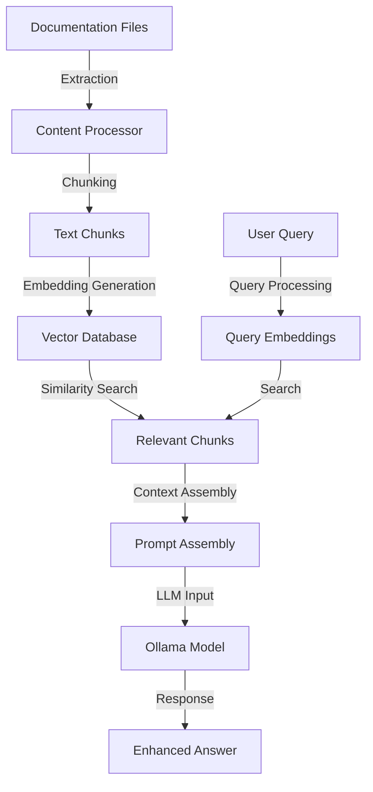

# Retrieval Augmented Generation (RAG)

This section outlines the RAG pipeline for Obelisk, which enables the chatbot to retrieve and reference content directly from your documentation.

## What is RAG?

Retrieval Augmented Generation (RAG) is a technique that enhances Large Language Models (LLMs) by providing them with relevant information retrieved from a knowledge base before generating responses. This approach combines the strengths of:

1. **Retrieval systems** - Finding relevant content from your knowledge base
2. **Generation capabilities** - Using that content to produce accurate, contextual responses

For Obelisk, this means the AI chatbot will be able to answer questions based specifically on your documentation content.

## RAG Architecture

The Obelisk RAG pipeline will consist of several key components:



1. **Content Processing**: Extract content from Markdown files in your Obsidian vault
2. **Chunking**: Split content into appropriate segments for embedding
3. **Embedding Generation**: Convert text chunks into vector embeddings
4. **Vector Storage**: Store embeddings in a vector database for efficient retrieval
5. **Query Processing**: Process and embed user queries
6. **Retrieval**: Find the most relevant document chunks
7. **Context Assembly**: Combine retrieved content into a prompt
8. **Response Generation**: Generate accurate responses based on retrieved content

## Implementation Roadmap

The RAG pipeline will be implemented in phases:

| Phase | Feature | Status |
|-------|---------|--------|
| 1 | Document Processing Pipeline | Completed ✓ |
| 2 | Vector Database Integration | Completed ✓ |
| 3 | Query Processing & Retrieval | Completed ✓ |
| 4 | Integration with Ollama | Completed ✓ |
| 5 | Web UI Extensions | Planned |

## Document Processing

### Content Extraction

The RAG pipeline will extract content from your Obsidian vault:

```python
# Implemented in obelisk/rag/document.py
class DocumentProcessor:
    """Process markdown documents for the RAG system."""
    
    def process_directory(self, directory: str = None) -> List[Document]:
        """Process all markdown files in a directory."""
        if directory is None:
            directory = self.config.get("vault_dir")
        
        all_chunks = []
        for md_file in glob.glob(f"{directory}/**/*.md", recursive=True):
            chunks = self.process_file(md_file)
            all_chunks.extend(chunks)
        
        return all_chunks
    
    def process_file(self, file_path: str) -> List[Document]:
        """Process a single markdown file."""
        # Read and process the file
        with open(file_path, 'r', encoding='utf-8') as f:
            content = f.read()
        
        # Create a Document object with metadata
        doc = Document(page_content=content, metadata={"source": file_path})
        
        # Extract YAML frontmatter as metadata
        self._extract_metadata(doc)
        
        # Split into chunks with overlap
        chunks = self.text_splitter.split_documents([doc])
        
        return chunks
```

### Chunking Strategies

Documents will be split into chunks using various strategies:

- **Fixed-size chunks**: Split by character or token count
- **Semantic chunks**: Split by headings or semantic boundaries
- **Overlapping chunks**: Create overlapping segments to maintain context

### Metadata Enhancement

Each chunk will be enhanced with metadata:

- Source document and location
- Heading hierarchy
- Last updated date
- Tags and categories
- Related documents