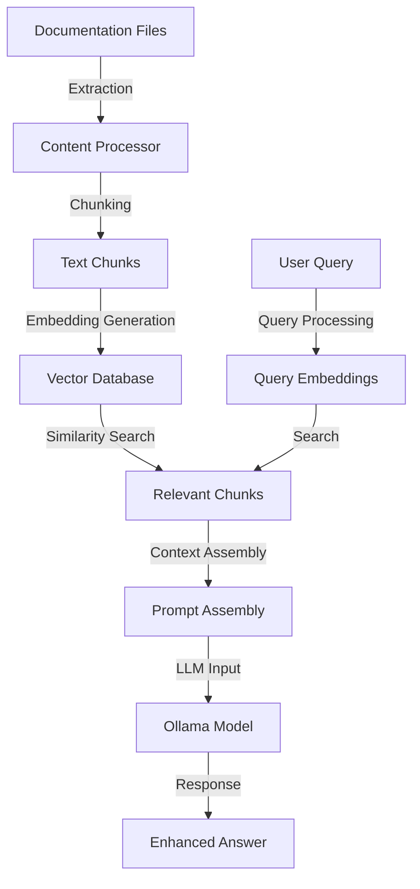

# Retrieval Augmented Generation (RAG)

This section outlines the future RAG pipeline for Obelisk, which will enable the chatbot to retrieve and reference content directly from your documentation.

## What is RAG?

Retrieval Augmented Generation (RAG) is a technique that enhances Large Language Models (LLMs) by providing them with relevant information retrieved from a knowledge base before generating responses. This approach combines the strengths of:

1. **Retrieval systems** - Finding relevant content from your knowledge base
2. **Generation capabilities** - Using that content to produce accurate, contextual responses

For Obelisk, this means the AI chatbot will be able to answer questions based specifically on your documentation content.

## Planned RAG Architecture

The Obelisk RAG pipeline will consist of several key components:



1. **Content Processing**: Extract content from Markdown files in your Obsidian vault
2. **Chunking**: Split content into appropriate segments for embedding
3. **Embedding Generation**: Convert text chunks into vector embeddings
4. **Vector Storage**: Store embeddings in a vector database for efficient retrieval
5. **Query Processing**: Process and embed user queries
6. **Retrieval**: Find the most relevant document chunks
7. **Context Assembly**: Combine retrieved content into a prompt
8. **Response Generation**: Generate accurate responses based on retrieved content

## Implementation Roadmap

The RAG pipeline will be implemented in phases:

| Phase | Feature | Status |
|-------|---------|--------|
| 1 | Document Processing Pipeline | Planned |
| 2 | Vector Database Integration | Planned |
| 3 | Query Processing & Retrieval | Planned |
| 4 | Integration with Ollama | Planned |
| 5 | Web UI Extensions | Planned |

## Document Processing

### Content Extraction

The RAG pipeline will extract content from your Obsidian vault:

```python
# Future implementation example
def extract_content(vault_path):
    """Extract content from Markdown files in the vault."""
    all_content = []
    for md_file in glob.glob(f"{vault_path}/**/*.md", recursive=True):
        with open(md_file, 'r') as f:
            content = f.read()
            # Process frontmatter and content
            metadata, text = process_markdown(content)
            all_content.append({
                'source': md_file,
                'metadata': metadata,
                'content': text
            })
    return all_content
```

### Chunking Strategies

Documents will be split into chunks using various strategies:

- **Fixed-size chunks**: Split by character or token count
- **Semantic chunks**: Split by headings or semantic boundaries
- **Overlapping chunks**: Create overlapping segments to maintain context

### Metadata Enhancement

Each chunk will be enhanced with metadata:

- Source document and location
- Heading hierarchy
- Last updated date
- Tags and categories
- Related documents