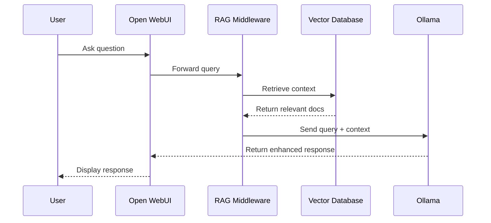

# Ollama Integration

This page details how the RAG pipeline will integrate with Ollama to provide context-aware responses.

## Integration Architecture

The RAG pipeline will interact with Ollama through its API:



## Ollama API Interaction

### Model Generation Endpoint

The RAG pipeline will use Ollama's generation API:

```http
POST /api/generate HTTP/1.1
Host: localhost:11434
Content-Type: application/json

{
  "model": "mistral",
  "prompt": "System: You are a helpful assistant. Use the following context to answer the question.\n\nContext: {retrieved_context}\n\nQuestion: {user_question}",
  "stream": false,
  "options": {
    "temperature": 0.7,
    "top_p": 0.9,
    "top_k": 40,
    "num_ctx": 4096
  }
}
```

### Context Formatting

The context will be formatted before being sent to Ollama:

```python
# Future implementation example
def format_context_for_ollama(retrieved_chunks):
    """Format retrieved chunks into a context string for Ollama."""
    formatted_chunks = []
    
    for i, chunk in enumerate(retrieved_chunks):
        formatted_chunks.append(
            f"[Document {i+1}] {chunk['metadata']['source']}\n"
            f"---\n"
            f"{chunk['text']}\n"
        )
    
    return "\n\n".join(formatted_chunks)
```

## Custom Modelfiles

Obelisk will provide custom Modelfiles optimized for RAG:

```
FROM mistral:latest

# Optimize for RAG
PARAMETER num_ctx 8192
PARAMETER temperature 0.7
PARAMETER top_p 0.9
PARAMETER top_k 40

# System instruction for RAG
SYSTEM You are a helpful documentation assistant for the Obelisk documentation system.
SYSTEM When given context from the documentation, use this information to answer the user's question.
SYSTEM Always attribute your sources and only provide information contained in the given context.
SYSTEM If the information can't be found in the context, acknowledge this and suggest where the user might find more information.
```

## Embedding Models

The RAG pipeline will use embedding models via Ollama:

| Model | Description | Size | Performance |
|-------|-------------|------|-------------|
| nomic-embed-text | General text embeddings | 137M | High quality |
| mxbai-embed-large | Multilingual embeddings | 137M | Multilingual support |
| all-mxbai-embed-large | Specialized code embeddings | 137M | Code-focused |

Example embedding request:

```http
POST /api/embeddings HTTP/1.1
Host: localhost:11434
Content-Type: application/json

{
  "model": "nomic-embed-text",
  "prompt": "The text to be embedded"
}
```

## Memory Management

When dealing with limited resources:

1. **Context pruning**: Dynamically adjust context size based on available memory
2. **Quantization selection**: Use higher quantization levels (Q4_0) for large models
3. **Context batching**: Process chunks in batches for large documents
4. **Model swapping**: Automatically switch between models based on query complexity

## Response Processing

After receiving responses from Ollama:

1. **Citation extraction**: Identify and format source citations
2. **Response validation**: Verify that the response uses the provided context
3. **Confidence scoring**: Assess confidence in the generated response
4. **Metadata enrichment**: Add metadata about sources used

Example response processing:

```python
# Future implementation example
def process_ollama_response(response, retrieved_chunks):
    """Process and enhance response from Ollama."""
    text = response["response"]
    
    # Extract and verify citations
    citations = extract_citations(text)
    valid_citations = verify_citations(citations, retrieved_chunks)
    
    # Format citations and append source information
    enhanced_response = format_response_with_citations(text, valid_citations)
    
    # Add metadata
    metadata = {
        "sources_used": [chunk["metadata"]["source"] for chunk in retrieved_chunks],
        "confidence_score": calculate_confidence(text, retrieved_chunks),
        "model_used": response["model"],
        "response_time": response["total_duration"] / 1000000000  # Convert ns to s
    }
    
    return {
        "response": enhanced_response,
        "metadata": metadata
    }
```

## Performance Optimization

To optimize performance with Ollama:

1. **Batched embeddings**: Process multiple chunks in a single API call
2. **Connection pooling**: Maintain persistent connections
3. **Response streaming**: Stream responses for faster initial display
4. **Caching layer**: Cache common queries and embeddings
5. **Load balancing**: Support multiple Ollama instances for high demand

## Fallback Mechanisms

The system will include fallbacks when Ollama cannot provide good answers:

1. **General knowledge fallback**: Use model's general knowledge when no context is found
2. **Search suggestions**: Recommend search terms for more relevant results
3. **Documentation navigation**: Suggest navigation paths in the documentation
4. **Human handoff**: Provide contact information for human assistance

## Security Considerations

Important security aspects of the Ollama integration:

1. **Input validation**: Sanitize all inputs to prevent prompt injection
2. **Rate limiting**: Prevent abuse with rate limits
3. **Output filtering**: Filter sensitive information from responses
4. **Network isolation**: Restrict network access to the Ollama API
5. **Authentication**: Add optional authentication for API access