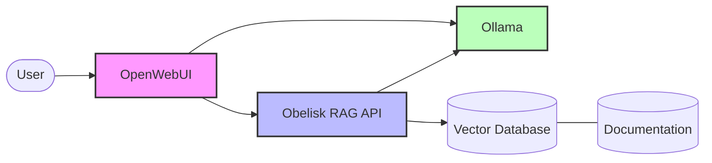

# Integrating RAG with Open WebUI

This document provides comprehensive instructions for integrating Obelisk's RAG system with [Open WebUI](https://github.com/open-webui/open-webui), an advanced interface for interacting with large language models.

## Overview

Open WebUI can leverage Obelisk's RAG capabilities to provide context-aware responses based on your documentation. The integration works through an OpenAI-compatible API provided by the Obelisk RAG service, allowing Open WebUI to seamlessly retrieve and use relevant documentation chunks when answering questions.

## Integration Architecture



## Configuration

### Docker Compose Configuration

To integrate Open WebUI with the RAG service, configure the following environment variables in your `docker-compose.yaml` file:

```yaml
services:
  open-webui:
    # ... other configuration ...
    environment:
      # ... other environment variables ...
      # RAG configuration
      - RAG_ENABLED=true
      - RAG_SERVICE_TYPE=custom
      - RAG_SERVICE_URL=http://obelisk-rag:8000/v1
      - "RAG_TEMPLATE=You are a helpful assistant. Use the following pieces of retrieved context to answer the user's question. If you don't know the answer, just say that you don't know.\n\nContext:\n{{context}}\n\nUser question: {{query}}"
    depends_on:
      - ollama
      - obelisk-rag
```

### Environment Variables

| Variable | Description | Example Value |
|----------|-------------|---------------|
| `RAG_ENABLED` | Enable RAG functionality | `true` |
| `RAG_SERVICE_TYPE` | Type of RAG service | `custom` |
| `RAG_SERVICE_URL` | URL to the RAG API endpoint | `http://obelisk-rag:8000/v1` |
| `RAG_TEMPLATE` | Prompt template for context injection | See example below |

### Prompt Template

The `RAG_TEMPLATE` defines how retrieved context and user queries are presented to the language model. Here's the default template:

```
You are a helpful assistant. Use the following pieces of retrieved context to answer the user's question. If you don't know the answer, just say that you don't know.

Context:
{{context}}

User question: {{query}}
```

This template includes two placeholders:
- `{{context}}` - Where retrieved document chunks will be inserted
- `{{query}}` - Where the user's original question will be inserted

## How It Works

When a user asks a question through Open WebUI, the following process occurs:

1. Open WebUI sends the query to the Obelisk RAG API using the OpenAI-compatible endpoint
2. The RAG service:
   - Embeds the query into a vector representation
   - Searches the vector database for similar document chunks
   - Retrieves the most relevant document chunks
   - Formats these chunks as context using the RAG_TEMPLATE
3. The formatted query with context is sent to the language model (via Ollama)
4. The language model generates a response using the provided context
5. The response is returned to Open WebUI and displayed to the user

## Customizing the RAG Experience

### Adjusting Retrieved Context

To modify the number of context chunks retrieved for each query, adjust the `RETRIEVE_TOP_K` environment variable in the obelisk-rag service:

```yaml
services:
  obelisk-rag:
    # ... other configuration ...
    environment:
      # ... other environment variables ...
      - RETRIEVE_TOP_K=5  # Retrieve 5 chunks instead of default 3
```

Higher values provide more context but may dilute relevance. Lower values are more focused but might miss important information.

### Customizing the Prompt Template

You can customize the RAG_TEMPLATE to change how the assistant uses retrieved context:

```yaml
- 'RAG_TEMPLATE=You are an expert on Obelisk documentation. When answering, cite your sources using [Document Name] notation. Use these documentation excerpts to answer:\n\n{{context}}\n\nQuestion: {{query}}'
```

Effective customizations include:
- Adjusting the assistant's persona
- Requesting specific citation formats
- Changing the response style (brief, detailed, technical, simplified)
- Adding instructions for handling unanswerable questions

### Selecting Different Models

Configure the language model used for generating responses by modifying the `OLLAMA_MODEL` environment variable:

```yaml
services:
  obelisk-rag:
    # ... other configuration ...
    environment:
      # ... other environment variables ...
      - OLLAMA_MODEL=llama3  # Or other models like mistral, phi-3-mini, etc.
```

Similarly, you can change the embedding model with `EMBEDDING_MODEL`:

```yaml
- EMBEDDING_MODEL=mxbai-embed-large  # Default embedding model
```

## Testing the Integration

To verify the RAG integration is working correctly:

1. Ensure all services are running with `docker-compose ps`
2. Open the Open WebUI interface at `http://localhost:8080`
3. Log in with your credentials
4. Select a model with RAG capabilities
5. Ask a question related to your documentation, for example:
   ```
   How do I configure the RAG service?
   ```
6. The response should include information from your documentation

## Troubleshooting

### Common Issues

| Issue | Possible Cause | Solution |
|-------|---------------|----------|
| No context retrieved | Documents not indexed | Run `docker exec obelisk-rag python -m obelisk.rag.cli index` |
| Incorrect responses | Irrelevant context | Increase context quality by improving document chunking or adjust RETRIEVE_TOP_K |
| RAG not being used | Configuration issue | Check RAG_ENABLED is true and RAG_SERVICE_URL is correct |
| Slow responses | Large document corpus | Optimize embeddings or reduce context size |

### Checking RAG Status

To verify the RAG system status:

```bash
curl http://localhost:8001/stats
```

This will return information about indexed documents and the current configuration.

### Viewing RAG Logs

To view the RAG service logs for diagnostic information:

```bash
docker logs obelisk-rag
```

## Advanced Configuration

### Using Multiple RAG Models

Open WebUI allows creating multiple models with different RAG configurations. To set up specialized models:

1. In Open WebUI, go to "Models"
2. Click "Create New Model"
3. Select an Ollama model as the base
4. Enable "Use with RAG"
5. Configure RAG settings specific to this model
6. Save the model

This allows having specialized models for different documentation sections or query types.

### Hybrid Search

While not implemented in the current version, future updates may support hybrid search combining vector similarity with keyword matching for improved retrieval quality.

## Example: Full Integration

Below is a complete example of docker-compose configuration for integrating Open WebUI with the Obelisk RAG system:

```yaml
services:
  open-webui:
    container_name: open-webui
    image: ghcr.io/open-webui/open-webui:main
    environment:
      - MODEL_DOWNLOAD_DIR=/models
      - OLLAMA_API_BASE_URL=http://ollama:11434
      - OLLAMA_URL=http://ollama:11434
      - LOG_LEVEL=debug
      # RAG configuration
      - RAG_ENABLED=true
      - RAG_SERVICE_TYPE=custom
      - RAG_SERVICE_URL=http://obelisk-rag:8000/v1
      - "RAG_TEMPLATE=You are a helpful assistant. Use the following pieces of retrieved context to answer the user's question. If you don't know the answer, just say that you don't know.\n\nContext:\n{{context}}\n\nUser question: {{query}}"
    volumes:
      - data:/data
      - models:/models
      - open-webui:/config
    ports:
      - "8080:8080"
    depends_on:
      - ollama
      - obelisk-rag
    networks:
      - ollama-net

  ollama:
    container_name: ollama
    image: ollama/ollama:latest
    # ... ollama configuration ...

  obelisk-rag:
    container_name: obelisk-rag
    build:
      context: .
      dockerfile: Dockerfile.rag
    volumes:
      - rag-data:/app/data
      - rag-vault:/app/vault
    ports:
      - "8001:8000"
    environment:
      - VAULT_DIR=/app/vault
      - CHROMA_DIR=/app/data/chroma_db
      - OLLAMA_URL=http://ollama:11434
      - OLLAMA_MODEL=llama3
      - EMBEDDING_MODEL=mxbai-embed-large
      - RETRIEVE_TOP_K=3
      - API_HOST=0.0.0.0
      - API_PORT=8000
      - LOG_LEVEL=INFO
    depends_on:
      - ollama
    networks:
      - ollama-net
```

## Further Reading

- [Using RAG](./using-rag.md) - Complete documentation on Obelisk's RAG capabilities
- [Ollama Integration](./ollama-integration.md) - Details on Ollama integration
- [Open WebUI Documentation](https://docs.openwebui.com/) - Official Open WebUI documentation