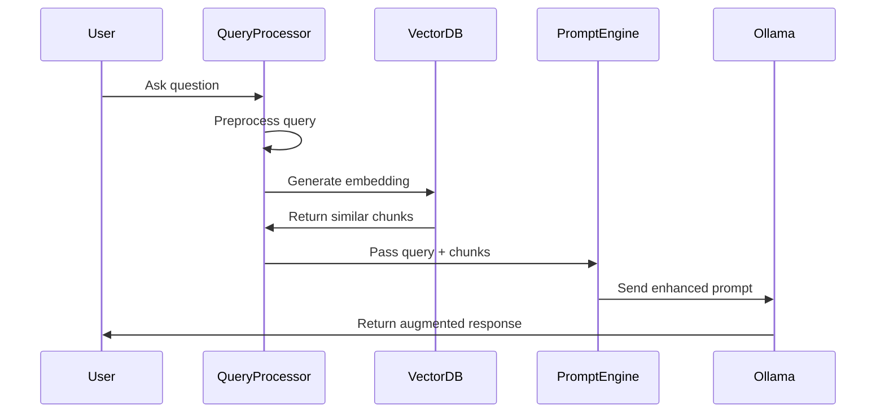

# Query Pipeline

The query pipeline is a critical component of the Obelisk RAG system, processing user questions and retrieving relevant content to enhance AI responses.

## Query Flow Architecture

The query pipeline follows these steps:



## Query Preprocessing

Before retrieval, queries undergo several preprocessing steps:

1. **Query expansion**: Enhance queries with related terms
2. **Intent recognition**: Identify the type of question
3. **Metadata extraction**: Extract filters from the query
4. **Language detection**: Handle multilingual queries
5. **Query rewriting**: Optimize for retrieval performance

Example implementation:

```python
# Future implementation example
def preprocess_query(query_text):
    """Preprocess user query for optimal retrieval."""
    # Clean and normalize text
    cleaned_query = clean_text(query_text)
    
    # Extract potential filters
    filters = extract_metadata_filters(cleaned_query)
    
    # Expand query with related terms
    expanded_query = query_expansion(cleaned_query)
    
    return {
        "original_query": query_text,
        "processed_query": expanded_query,
        "filters": filters,
        "detected_intent": detect_intent(cleaned_query)
    }
```

## Retrieval Strategies

The pipeline will implement multiple retrieval strategies:

### 1. Dense Retrieval

Using vector similarity to find relevant content:

- **Embedding space**: Convert query to the same embedding space as documents
- **Similarity metrics**: Cosine similarity, dot product, or Euclidean distance
- **Top-k retrieval**: Return the k most similar chunks

### 2. Hybrid Search

Combining multiple search techniques:

- **BM25 keyword search**: Traditional information retrieval
- **Dense vector search**: Semantic similarity
- **Fusion methods**: Reciprocal rank fusion or weighted combinations

### 3. Multi-stage Retrieval

A two-step process for better results:

- **Initial retrieval**: Get a larger set of potentially relevant chunks
- **Re-ranking**: Apply more complex models to re-rank results
- **Diversity optimization**: Ensure varied context

## Context Assembly

Retrieved chunks are assembled into a coherent context:

1. **Chunk sorting**: Order by relevance and document structure
2. **Deduplication**: Remove redundant information
3. **Context limitation**: Fit within model context window
4. **Metadata inclusion**: Add source information

## Prompt Engineering

Crafting effective prompts is essential for quality responses:

### Basic RAG Prompt Template

```
You are an assistant for the Obelisk documentation.
Answer the question based ONLY on the following context:

{retrieved_context}

Question: {user_question}

Answer:
```

### Advanced RAG Prompt Template

```
You are an assistant for the Obelisk documentation system.
Use ONLY the following retrieved documentation to answer the user's question.
If the information is not in the retrieved docs, acknowledge that and suggest where they might find the information.

Retrieved documentation:
{retrieved_chunks}

User question: {user_question}

Respond in a helpful, concise manner. Include code examples if relevant.
Always cite your sources using the document names provided in the retrieved chunks.
```

## Response Generation

The final step involves:

1. **Model invocation**: Send the assembled prompt to Ollama
2. **Parameter optimization**: Adjust temperature, top_p, etc.
3. **Citation tracking**: Maintain source references
4. **Response validation**: Ensure factuality and relevance
5. **Fallback strategies**: Handle cases with no relevant context

## Measuring Effectiveness

The RAG pipeline will include evaluation metrics:

- **Retrieval precision/recall**: Measure retrieval quality
- **Answer relevance**: Assess response relevance
- **Factual accuracy**: Verify factual correctness
- **Citation accuracy**: Check if sources are properly cited
- **User satisfaction**: Collect user feedback