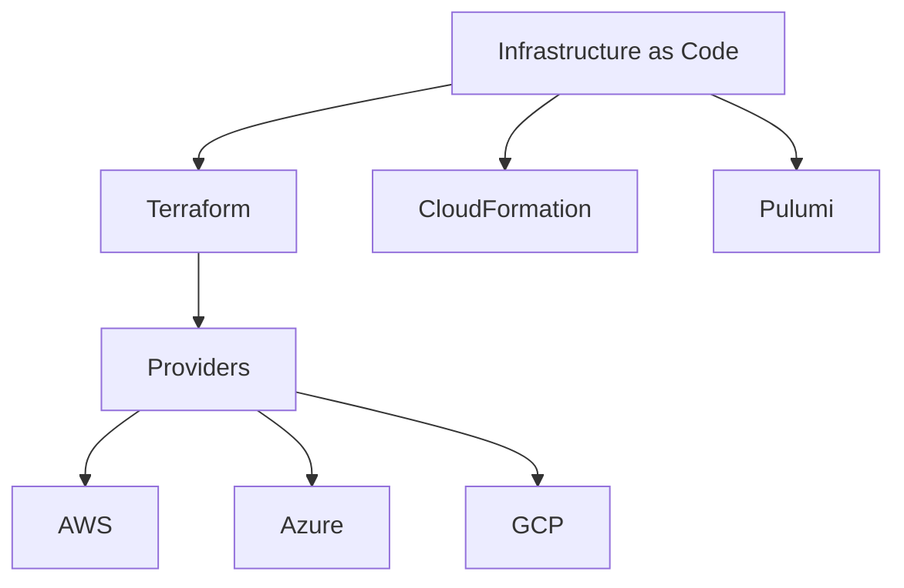

# Cloud Native Tooling

A collection of cloud-native tools and resources.

---

**Categories**: cloud ☁️ • kubernetes 🚢 • devops 🔄 • infrastructure 🏗️

---

## Kubernetes

!!! info "Kubernetes"
    Kubernetes is an open-source platform for automating deployment, scaling, and operations of application containers across clusters of hosts.

### Key Components

- **Pods**: The smallest deployable units in Kubernetes
- **Services**: Abstract way to expose applications running on pods
- **Deployments**: Declarative updates for pods and replica sets
- **ConfigMaps**: External configuration for applications

## Infrastructure as Code

## Container Technologies

| Technology | Description | Use Case |
|------------|-------------|----------|
| Docker     | Container platform | Development, packaging |
| Podman     | Daemonless container engine | Security-focused environments |
| Buildah    | Building OCI images | CI/CD pipelines |
| Containerd | Container runtime | Kubernetes environments |

## DevOps Practices

- Continuous Integration
- Continuous Delivery
- Infrastructure as Code
- Observability
- Security as Code

!!! tip "Best Practice"
    Implement GitOps workflows to manage infrastructure and application deployments through Git repositories.