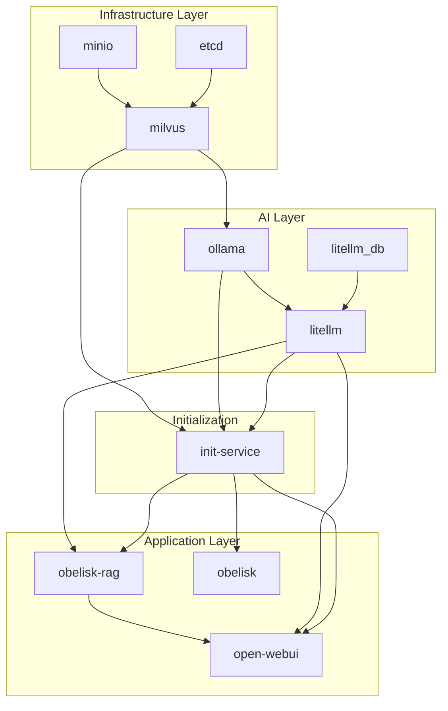
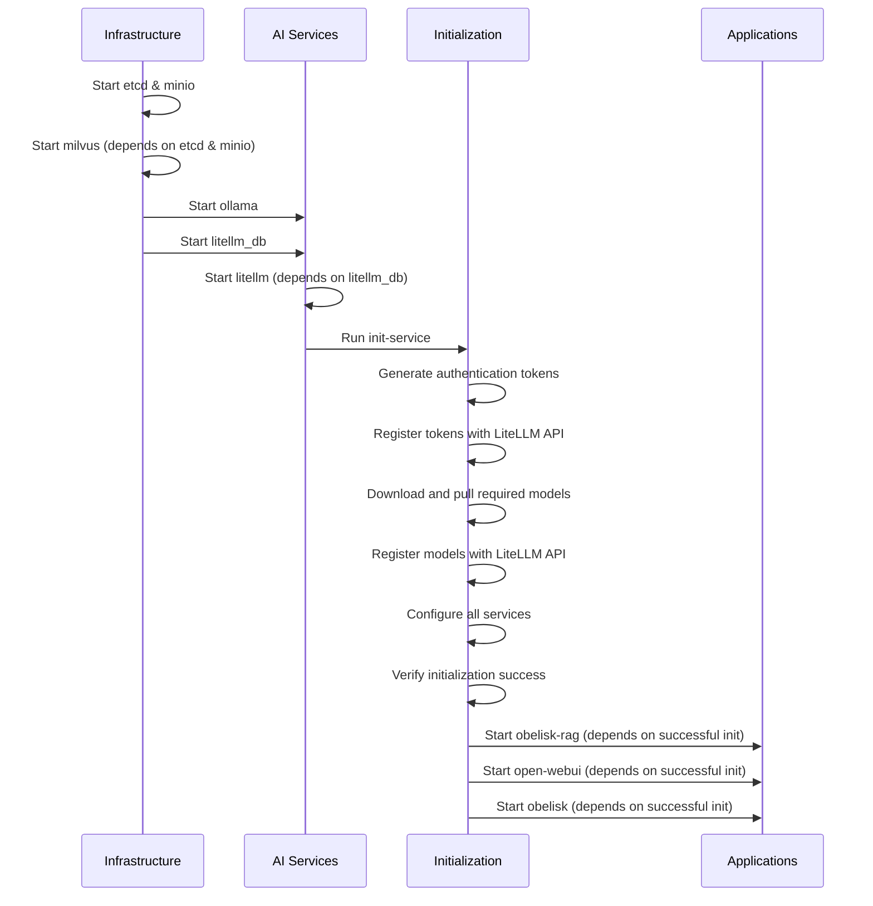

# Obelisk Container Initialization and Testing Guide

This comprehensive guide details the initialization process for the Obelisk container stack and provides a step-by-step testing procedure to ensure your deployment is functioning correctly. Whether you're a junior developer setting up Obelisk for the first time or a seasoned architect deploying in a production environment, this document will guide you through the entire process.

## Table of Contents

- [Overview](#overview)
- [System Architecture](#system-architecture)
- [Prerequisites](#prerequisites)
- [Initialization Sequence](#initialization-sequence)
- [Step-by-Step Setup](#step-by-step-setup)
- [Validation and Testing](#validation-and-testing)
- [Troubleshooting](#troubleshooting)
- [Advanced Configuration](#advanced-configuration)
- [Technical Reference](#technical-reference)

## Overview

Obelisk is a system that transforms Obsidian vaults into MkDocs Material Theme sites with AI integration capabilities through Ollama and Open WebUI. The container architecture includes several interdependent services that require a specific initialization sequence to function correctly. This document explains the technical aspects of this process and provides a reliable testing procedure.

### Key Components

The Obelisk stack consists of:

1. **Documentation System**
   - `obelisk`: MkDocs documentation server
   - Documentation transformation pipeline

2. **AI Services**
   - `ollama`: Local LLM inference service
   - `open-webui`: Web interface for AI interaction
   - `litellm`: API proxy for model management

3. **RAG (Retrieval-Augmented Generation) Pipeline**
   - `obelisk-rag`: RAG API service
   - Vector embedding and storage
   - Document processing

4. **Vector Database**
   - `milvus`: Vector database for embeddings
   - `etcd`: Configuration store for Milvus
   - `minio`: Object storage for Milvus

5. **Support Services**
   - `litellm_db`: PostgreSQL database for LiteLLM
   - `tika`: Document processing for OpenWebUI
   - `init-service`: Container initialization manager

## System Architecture

The system follows a microservices architecture where each component fulfills a specific role. Understanding the interactions between these services is crucial for successful deployment and troubleshooting.

### Service Dependency Graph



### Data Flow

1. **Initialization Flow**: 
   - Token generation and distribution
   - Model downloading and registration
   - Service configuration

2. **Document Processing Flow**:
   - Documents stored in vault directory
   - Processed into vector embeddings
   - Stored in Milvus vector database

3. **Query Flow**:
   - User query received via OpenWebUI or API
   - Query embedded and similar documents retrieved
   - LLM generates response with document context
   - Response returned to user

## Prerequisites

Before starting the initialization process, ensure you have:

- Docker Engine (version 20.10.0+)
- Docker Compose (version 2.0.0+)
- Git (for repository access)
- 16GB RAM minimum (32GB recommended)
- 50GB available disk space
- NVIDIA GPU with CUDA support (optional but recommended)

### NVIDIA Setup (Optional)

If using GPU acceleration:

1. Install the NVIDIA Container Toolkit:
   ```bash
   # For Ubuntu
   distribution=$(. /etc/os-release;echo $ID$VERSION_ID)
   curl -s -L https://nvidia.github.io/nvidia-docker/gpgkey | sudo apt-key add -
   curl -s -L https://nvidia.github.io/nvidia-docker/$distribution/nvidia-docker.list | sudo tee /etc/apt/sources.list.d/nvidia-docker.list
   sudo apt update && sudo apt install -y nvidia-container-toolkit
   sudo systemctl restart docker
   ```

2. Verify GPU availability:
   ```bash
   docker run --rm --gpus all nvidia/cuda:11.0-base nvidia-smi
   ```

## Initialization Sequence

The initialization process follows a specific sequence to ensure all dependencies are properly established. This section explains the technical reasons behind this sequence.

### Sequence Diagram



### Initialization Steps Explained

1. **Infrastructure Setup (etcd, minio, milvus)**
   - etcd: Provides configuration store for Milvus
   - minio: Provides object storage for Milvus
   - milvus: Provides vector database capabilities

   These services must start first as they constitute the fundamental data infrastructure.

2. **AI Service Setup (ollama, litellm_db, litellm)**
   - ollama: Provides model serving capabilities
   - litellm_db: Stores API keys and configuration
   - litellm: Provides API proxy for models

   These services depend on the infrastructure but must be available before initialization.

3. **Initialization (init-service)**
   - Handles token generation and registration
   - Downloads required models
   - Configures services with appropriate settings
   - Verifies successful initialization

   This service orchestrates the preparation of the environment.

4. **Application Services (obelisk-rag, open-webui, obelisk)**
   - obelisk-rag: Provides RAG capabilities
   - open-webui: Provides user interface
   - obelisk: Serves documentation

   These services depend on successful initialization.

## Step-by-Step Setup

This section provides a detailed walkthrough of the initialization process, from repository setup to running all services.

### 1. Repository Setup

```bash
# Clone the repository
git clone https://github.com/usrbinkat/obelisk.git
cd obelisk

# If you're working with a specific feature branch
git checkout feat/container-initialization  # Optional
```

### 2. Clean Environment

Before starting, ensure a clean environment:

```bash
# Clean all containers, volumes, and cached data
task clean-all-purge

# Alternatively, if task is not installed
docker-compose down -v --remove-orphans
docker-compose rm -fsv
docker-compose down --rmi all
```

### 3. Build Containers

Build all service containers:

```bash
docker-compose build
```

This step compiles the container images for all services defined in the docker-compose.yaml file. It may take several minutes depending on your internet connection and machine performance.

### 4. Start Infrastructure Services

Start the foundational infrastructure services in order:

```bash
# Start etcd, minio, and milvus
docker-compose up -d etcd minio milvus

# Verify services are running
docker-compose ps etcd minio milvus
```

Key technical points:
- etcd must be fully operational before milvus can initialize
- minio provides the object storage layer for milvus
- milvus creates collections automatically upon first startup

### 5. Start Ollama Service

```bash
# Start Ollama
docker-compose up -d ollama

# Verify Ollama is running
docker-compose ps ollama
```

Ollama provides the foundation for LLM serving. It must be running before LiteLLM can register models.

### 6. Start LiteLLM Database and API

```bash
# Start LiteLLM database and API service
docker-compose up -d litellm_db litellm

# Verify services are running
docker-compose ps litellm_db litellm
```

Technical notes:
- LiteLLM requires a PostgreSQL database for API key storage and tracking
- The service initializes tables on first startup
- It provides an OpenAI-compatible API for model access

### 7. Run the Initialization Service

```bash
# Run the initialization service (this will run and exit when complete)
docker-compose up init-service
```

This is a critical step where:
1. Authentication tokens are generated with cryptographic security
2. Tokens are registered with the LiteLLM API using the master key
3. Required models are downloaded with retry capability:
   - mxbai-embed-large: For vector embeddings (~2GB)
   - llama3: For text generation (~4GB)
4. Models are registered with LiteLLM for proxy access
5. Configuration files are created for all services
6. Verification confirms successful initialization

Wait for this service to complete before proceeding. The process takes approximately 5-10 minutes on first run, as it downloads models.

### 8. Start Application Services

After initialization completes successfully:

```bash
# Start application services
docker-compose up -d obelisk-rag open-webui obelisk

# Verify all services are running
docker-compose ps
```

This starts the user-facing services that depend on successful initialization:
- obelisk-rag: Provides the RAG API at http://localhost:8001/
- open-webui: Provides the chat interface at http://localhost:8080/
- obelisk: Provides the documentation at http://localhost:8000/

## Validation and Testing

After completing the setup, it's crucial to verify that all components are functioning correctly. This section provides a comprehensive testing procedure.

### Automated Validation

Obelisk includes an automated validation script that checks initialization status:

```bash
# Run the validation script
cd /workspaces/obelisk && poetry run python hack/test_init.py
```

This script performs the following checks:
- Service health verification
- Token retrieval and authentication testing
- Model availability verification
- LiteLLM generation capability testing
- OpenWebUI accessibility testing

The script will output a detailed report of each test performed and its result.

### Manual Component Testing

For thorough validation, perform these manual checks:

#### 1. Verify LiteLLM API with Token Authentication

```bash
# Retrieve the token
LITELLM_TOKEN=$(docker-compose exec -T litellm grep LITELLM_API_TOKEN /app/tokens/api_tokens.env | cut -d= -f2)

# Test the API
curl -s -H "Authorization: Bearer ${LITELLM_TOKEN}" http://localhost:4000/models | jq
```

Expected output: A JSON list of available models including `llama3` and `mxbai-embed-large`.

#### 2. Test LiteLLM Generation

```bash
# Use the token to test generation
curl -X POST http://localhost:4000/v1/chat/completions \
  -H "Content-Type: application/json" \
  -H "Authorization: Bearer ${LITELLM_TOKEN}" \
  -d '{
    "model": "llama3",
    "messages": [{"role": "user", "content": "What is Obelisk?"}],
    "max_tokens": 100
  }'
```

Expected output: A JSON response containing generated text about Obelisk.

#### 3. Test Obelisk-RAG API

```bash
# Test the RAG API with the token
curl -X POST http://localhost:8001/v1/chat/completions \
  -H "Content-Type: application/json" \
  -H "Authorization: Bearer ${LITELLM_TOKEN}" \
  -d '{
    "model": "llama3",
    "messages": [{"role": "user", "content": "What is Obelisk?"}]
  }'
```

Expected output: A JSON response containing a generated answer, potentially with source references if documents are available.

#### 4. Test Web Interfaces

Verify all web interfaces are accessible:

```bash
# Test Obelisk MkDocs
curl -s -o /dev/null -w '%{http_code}\n' http://localhost:8000/

# Test OpenWebUI
curl -s -o /dev/null -w '%{http_code}\n' http://localhost:8080/

# Test Obelisk-RAG stats endpoint
curl -s -o /dev/null -w '%{http_code}\n' http://localhost:8001/stats
```

All should return 200 (or 302 for redirects), indicating successful access.

#### 5. Browser Interface Testing

For a complete end-to-end test, access these URLs in your browser:

- Documentation: http://localhost:8000/
- Chat Interface: http://localhost:8080/
- RAG Stats: http://localhost:8001/stats

In the OpenWebUI interface:
1. Navigate to Settings > LiteLLM
2. Verify the connection is working with the auto-generated token
3. Start a new chat and ask a question about Obelisk
4. Verify that responses are generated correctly

### Document Indexing Test

To test document indexing for RAG functionality:

```bash
# Create a test document
mkdir -p test-docs
echo -e "# Test Document\n\nThis is a unique test document for RAG testing." > test-docs/test.md

# Copy to the RAG vault
docker cp test-docs/test.md obelisk-rag:/app/vault/

# Wait for processing (about 10 seconds)
sleep 10

# Query for the content
curl -X POST http://localhost:8001/v1/chat/completions \
  -H "Content-Type: application/json" \
  -H "Authorization: Bearer ${LITELLM_TOKEN}" \
  -d '{
    "model": "llama3",
    "messages": [{"role": "user", "content": "What is in the test document?"}]
  }'
```

If functioning correctly, the response should reference content from the test document.

## Troubleshooting

This section addresses common issues that may occur during the initialization process.

### Initialization Failures

If the init-service fails, examine the logs for specific errors:

```bash
docker-compose logs init-service
```

Common initialization issues and solutions:

#### 1. Token Registration Failures

**Symptoms:**
- Error message: `Token registration failed`
- Authentication errors in LiteLLM logs

**Solutions:**
- Verify LiteLLM API is accessible: `curl -s http://localhost:4000/health`
- Check master key configuration in docker-compose.yaml
- Manually register token:
  ```bash
  LITELLM_TOKEN=$(docker-compose exec -T litellm grep LITELLM_API_TOKEN /app/tokens/api_tokens.env | cut -d= -f2)
  
  curl -s -X POST "http://localhost:4000/key/generate" \
    -H "Content-Type: application/json" \
    -H "Authorization: Bearer ${LITELLM_MASTER_KEY:-sk-1234}" \
    -d "{\"key\": \"$LITELLM_TOKEN\", \"metadata\": {\"description\": \"Manual registration\"}}"
  ```

#### 2. Model Download Failures

**Symptoms:**
- Error message: `Failed to pull model 'xxx' after xx retries`
- Missing models in `docker-compose exec ollama ollama list`

**Solutions:**
- Check Ollama logs: `docker-compose logs ollama`
- Verify network connectivity within containers
- Manually pull models:
  ```bash
  docker-compose exec ollama ollama pull mxbai-embed-large
  docker-compose exec ollama ollama pull llama3
  ```
- Check if model name has changed in recent Ollama releases

#### 3. Milvus Connection Issues

**Symptoms:**
- Error connecting to Milvus in initialization logs
- Milvus startup warnings

**Solutions:**
- Check Milvus logs: `docker-compose logs milvus`
- Verify etcd and minio are running: `docker-compose ps etcd minio`
- Restart Milvus: `docker-compose restart milvus`
- Check network configuration between containers

### Service-Specific Issues

#### Ollama Issues

**Symptom:** Ollama fails to start or respond

**Solutions:**
- Check for GPU conflicts: `docker-compose logs ollama | grep -i cuda`
- For non-GPU environments, edit docker-compose.yaml to remove GPU configuration
- Check resource allocation and memory availability
- Verify NVIDIA drivers are installed (for GPU usage)

#### LiteLLM Issues

**Symptom:** Authentication errors or model not found errors

**Solutions:**
- Check database connectivity: `docker-compose logs litellm_db`
- Verify token registration: `curl -s -H "Authorization: Bearer ${LITELLM_MASTER_KEY:-sk-1234}" http://localhost:4000/key/info`
- Check model registration: `curl -s -H "Authorization: Bearer ${LITELLM_TOKEN}" http://localhost:4000/models`

#### RAG API Issues

**Symptom:** No documents found, empty responses

**Solutions:**
- Check vector database connection: `docker-compose logs obelisk-rag | grep -i milvus`
- Verify document processing: `docker-compose exec obelisk-rag ls -la /app/vault/`
- Check embeddings: `curl -s http://localhost:8001/stats`

## Advanced Configuration

### Environment Variable Reference

The system can be customized through environment variables in docker-compose.yaml:

| Variable | Service | Description | Default |
|----------|---------|-------------|---------|
| `LITELLM_MASTER_KEY` | LiteLLM | Master key for token registration | sk-1234 |
| `LITELLM_API_TOKEN` | Generated | Token for service authentication | (auto-generated) |
| `OLLAMA_MODEL` | Ollama | Default model for generation | llama3 |
| `EMBEDDING_MODEL` | Obelisk-RAG | Model for vector embeddings | mxbai-embed-large |
| `MILVUS_HOST` | Obelisk-RAG | Milvus host | milvus |
| `MILVUS_PORT` | Obelisk-RAG | Milvus port | 19530 |
| `CHUNK_SIZE` | Obelisk-RAG | Document chunking size | 2500 |
| `CHUNK_OVERLAP` | Obelisk-RAG | Overlap between chunks | 500 |
| `RETRIEVE_TOP_K` | Obelisk-RAG | Number of chunks to retrieve | 5 |
| `VECTOR_DB` | Obelisk-RAG | Vector database type | milvus |

### Custom Model Configuration

To use different models:

1. Edit the `docker-compose.yaml` file to update environment variables:
   ```yaml
   obelisk-rag:
     environment:
       - OLLAMA_MODEL=mistral  # Change to desired model
       - EMBEDDING_MODEL=nomic-embed-text  # Change to desired embedding model
   ```

2. Pull the model before starting services:
   ```bash
   docker-compose up -d ollama
   docker-compose exec ollama ollama pull mistral
   docker-compose exec ollama ollama pull nomic-embed-text
   ```

3. Update the LiteLLM configuration:
   ```bash
   docker-compose exec litellm bash -c "cat > /app/config/litellm_config.yaml << EOF
   model_list:
     - model_name: mistral
       litellm_params:
         model: ollama/mistral
         api_base: http://ollama:11434
     - model_name: nomic-embed-text
       litellm_params:
         model: ollama/nomic-embed-text
         api_base: http://ollama:11434
   
   # Authentication
   api_key: ${LITELLM_API_TOKEN}
   EOF"
   ```

### Persistent Document Storage

For persistent document storage:

1. Mount a local directory to the RAG vault:
   ```yaml
   obelisk-rag:
     volumes:
       - ./your-local-docs:/app/vault:ro  # Read-only mount
   ```

2. Restart the service:
   ```bash
   docker-compose restart obelisk-rag
   ```

### Custom Prompt Templates

Customize the RAG prompt template:

1. Create a custom template file:
   ```bash
   cat > rag_template.txt << EOF
   Answer the following question based on the provided documents.
   If you don't know the answer, say so clearly.
   
   Documents:
   {{context}}
   
   Question: {{query}}
   
   Answer:
   EOF
   ```

2. Mount it to the container:
   ```yaml
   obelisk-rag:
     volumes:
       - ./rag_template.txt:/app/rag_template.txt
     environment:
       - RAG_TEMPLATE_PATH=/app/rag_template.txt
   ```

## Technical Reference

This section provides technical details about the internals of the initialization process.

### Initialization Scripts

The initialization process is managed by scripts in the `docker/init-scripts/` directory:

| Script | Purpose | Key Technical Functions |
|--------|---------|-------------------------|
| init-sequence.sh | Master controller | Orchestrates initialization sequence, performs verification |
| generate-tokens.sh | Token management | Creates secure cryptographic tokens, registers with APIs |
| download-models.sh | Model management | Checks model availability, pulls models, handles registration |
| configure-services.sh | Service configuration | Creates configuration files for each service |

### Docker Container Specifications

| Container | Base Image | Key Dependencies | Function |
|-----------|------------|------------------|----------|
| init-service | python:3.12-slim | curl, bash | Performs initialization |
| ollama | ollama/ollama:latest | CUDA (optional) | Serves LLMs |
| litellm | ghcr.io/berriai/litellm:main-latest | PostgreSQL | API proxy |
| milvus | milvusdb/milvus:v2.5.10 | etcd, minio | Vector database |
| obelisk-rag | python:3.12-slim | langchain, fastapi | RAG service |

### Token Generation Mechanism

The token generation process uses OpenSSL to create cryptographically secure tokens:

- LiteLLM API tokens: 12 bytes of hexadecimal with `sk-` prefix
- OpenWebUI tokens: 32 bytes in base64 encoding

These tokens are stored in a shared volume at `/app/tokens/api_tokens.env` and are accessible to all services that require authentication.

### Verification Process

The initialization performs an exhaustive verification:

1. Token file existence and format validation
2. Ollama API accessibility and response validation
3. LiteLLM token authentication verification
4. Model download confirmation
5. Model registration confirmation with LiteLLM API

This multi-step verification ensures the system is fully operational before allowing application services to start.

### Networking Architecture

The services communicate through a Docker bridge network:

```
networks:
  ollama-net:
    driver: bridge
```

Service discovery is handled through Docker's DNS resolution, allowing services to reference each other by container name (e.g., `http://ollama:11434`).

### Data Volumes

The system uses these persistent volumes:

| Volume | Purpose | Services Using |
|--------|---------|----------------|
| ollama | Model storage | ollama |
| models | Shared models | ollama, open-webui |
| milvus_data | Vector database | milvus |
| rag-data | RAG database | obelisk-rag |
| rag-vault | Document storage | obelisk-rag |
| tokens | Authentication tokens | multiple |
| config | Service configurations | multiple |

## Conclusion

This comprehensive guide has walked you through the technical details of the Obelisk container initialization and testing process. By following this procedure, you can ensure a reliable and fully functional deployment of the Obelisk stack.

The initialization process has been carefully designed to handle dependencies, ensure proper configuration, and validate the functionality of all components. By understanding the purpose and inner workings of each step, you can effectively troubleshoot issues and customize the system to your specific needs.

For additional help or to report issues, please refer to the [GitHub repository](https://github.com/usrbinkat/obelisk) or submit a detailed bug report with logs and system information.