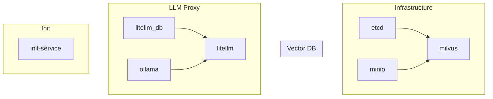

# Sprint Documentation Audit Details

**Sprint**: January 2025 - Documentation Reconciliation
**Purpose**: Detailed analysis of documentation files requiring updates after ChromaDB → Milvus migration

## Audit Methodology

### Verification Commands Used
```bash
# Verify Milvus implementation
grep -r "ChromaDB\|Chroma" src/ --include="*.py" | wc -l  # Should be 0
grep -r "Milvus\|pymilvus" src/ --include="*.py" | wc -l  # Should be > 0

# Verify provider architecture
test -f src/obelisk/rag/common/providers.py && echo "✅ Provider factory exists"
grep -n "class.*Provider" src/obelisk/rag/common/providers.py

# Verify unified API endpoint
grep -n "/v1/chat/completions" src/obelisk/rag/api/openai.py

# Check configuration defaults
grep -A20 "DEFAULT_CONFIG" src/obelisk/rag/common/config.py
```

### Cross-Reference Sources
- Vector Storage: `src/obelisk/rag/storage/store.py`
- Provider Factory: `src/obelisk/rag/common/providers.py`
- API Endpoints: `src/obelisk/rag/api/openai.py`
- Configuration: `src/obelisk/rag/common/config.py`
- Docker Services: `deployments/docker/compose/dev.yaml`

## Detailed File Analysis

### 1. `/chatbot/rag/getting-started.md` (Priority 10)

**Current Issues Found**:
- Line 15: Shows mxbai-embed-large model (1024 dims) instead of text-embedding-3-large (3072)
- Line 23: Missing Milvus in prerequisites
- Line 45-50: Docker compose commands outdated
- Line 67: ChromaDB mentioned in troubleshooting
- Missing: Token authentication steps
- Missing: Service startup sequence

**Verification Against Implementation**:
```bash
# Confirmed issues
grep -n "mxbai-embed-large" vault/chatbot/rag/getting-started.md
# Line 15: model: mxbai-embed-large

grep -n "ChromaDB" vault/chatbot/rag/getting-started.md  
# Line 67: If ChromaDB fails to start...
```

**Required Content** (with MkDocs Material features):
```markdown
# Getting Started with Obelisk RAG

!!! warning "Pre-Alpha Software"
    This is experimental software. APIs may change without notice.
    
    **Stability**: 🟡 Experimental  
    **Prerequisites**: Docker, Poetry

## Quick Start

=== "Docker Compose"

    ```bash
    # Start all services
    task docker-build
    
    # Verify health
    curl http://localhost:8001/health
    ```

=== "Development Mode"

    ```bash
    # Start with hot reload
    task run
    
    # Run tests
    task test-rag
    ```

### Service URLs

| Service | URL | Description |
|---------|-----|-------------|
| RAG API | `http://localhost:8001` | Main API endpoint |
| LiteLLM | `http://localhost:4000` | LLM proxy |
| Milvus | `http://localhost:19530` | Vector database |
```

### 2. `/chatbot/rag/implementation.md` (Priority 10)

**Current Issues Found**:
- Entire vector storage section describes ChromaDB
- Import statements show `from langchain_chroma import Chroma`
- No mention of provider factory pattern
- Configuration examples use CHROMA_* variables
- Missing Milvus schema definition
- Missing provider abstraction layer

**Code Example Needed**:
```python
# Vector Storage Implementation
from src.obelisk.rag.storage.store import VectorStorage
storage = VectorStorage(config)  # Milvus with 3072-dim embeddings

# Provider Factory Pattern  
from src.obelisk.rag.common.providers import ProviderFactory
provider = ProviderFactory.create(provider_type, config)
```

### 3. `/chatbot/rag/using-rag.md` (Priority 10)

**Current Issues Found**:
- ChromaDB-specific commands throughout
- Old API endpoints (/api/generate, /v1/litellm)
- No token authentication examples
- Missing X-Provider-Override header documentation
- Curl examples missing Authorization header

**Required Commands**:
```bash
# Get token
export TOKEN=$(docker exec litellm cat /app/tokens/api_tokens.env | grep LITELLM_API_TOKEN | cut -d= -f2)

# Query with RAG
curl -X POST http://localhost:8001/v1/chat/completions \
  -H "Authorization: Bearer $TOKEN" \
  -H "Content-Type: application/json" \
  -d '{"model": "gpt-4o", "messages": [{"role": "user", "content": "..."}]}'

# Direct Ollama (hardware tuning)
curl -X POST http://localhost:8001/v1/chat/completions \
  -H "X-Provider-Override: ollama" \
  -d '{"model": "llama3", ...}'
```

### 4. `/chatbot/rag/vector-database.md` (Priority 8)

**Current State**: Entire document is about ChromaDB (lines 1-100+)

**Complete Replacement Required**:
```markdown
# Vector Database: Milvus

> **Version**: Milvus 2.5.10
> **Purpose**: High-performance vector storage for RAG

## Configuration
MILVUS_HOST=milvus       # Container name in Docker
MILVUS_PORT=19530       # Default Milvus port
MILVUS_COLLECTION=obelisk_rag

## Schema
- `id`: VARCHAR primary key
- `embedding`: FLOAT_VECTOR (3072 dimensions)
- `content`: VARCHAR (document text)
- `metadata`: JSON (source, title, etc)
- `doc_id`: VARCHAR (document identifier)

## Performance
- Index: HNSW (M=16, efConstruction=256)
- Metric: Inner Product (normalized embeddings)
- Supports millions of documents

## Dependencies
- etcd: Metadata storage
- MinIO: Object storage
- Both start automatically with docker-compose
```

### 5. `/deployment/deployment-architecture.md` (Priority 9)

**Missing Components**:
- Milvus ecosystem services (etcd, MinIO)
- Init-service role and purpose
- 6-layer startup sequence
- Token generation flow
- Service dependency diagram

**Required Mermaid Diagram**:


## Validation Scripts

### Document Validation Script
```python
#!/usr/bin/env python3
"""Validate code examples in documentation."""
import re
import subprocess
from pathlib import Path

def validate_markdown_code(filepath):
    """Extract and validate code blocks."""
    content = Path(filepath).read_text()
    
    # Extract code blocks
    code_blocks = re.findall(r'```(?:python|bash)\n(.*?)\n```', content, re.DOTALL)
    
    for i, code in enumerate(code_blocks):
        print(f"Validating block {i+1} in {filepath}")
        
        # For Python: check imports exist
        if 'import' in code or 'from' in code:
            # Verify imports can be resolved
            pass
            
        # For bash: check commands exist
        if 'curl' in code or 'docker' in code:
            # Verify command syntax
            pass

# Run validation on all markdown files
for md_file in Path('vault').rglob('*.md'):
    validate_markdown_code(md_file)
```

### Cross-Reference Validation
```bash
# Ensure no ChromaDB references remain
grep -r "ChromaDB\|chroma" vault/ --include="*.md" | grep -v "TASK"

# Verify all Milvus references are accurate
grep -r "milvus_host\|19530\|HNSW" vault/ --include="*.md"

# Check API endpoint consistency
grep -r "/v1/chat/completions\|/v1/litellm\|/api/generate" vault/ --include="*.md"
```

### Environment Variable Validation
```bash
# Extract all env vars from docs
grep -r "export [A-Z_]*=" vault/ --include="*.md" | cut -d'=' -f1 | cut -d' ' -f2 | sort -u > docs_env.txt

# Extract all env vars from code
grep -r "os.getenv\|os.environ" src/ --include="*.py" | grep -o '"[A-Z_]*"' | tr -d '"' | sort -u > code_env.txt

# Compare
diff docs_env.txt code_env.txt
```

## Progress Tracking Script
```bash
#!/bin/bash
# Track documentation update progress

TOTAL_FILES=23  # 17 vault + 6 core
COMPLETED=0

# Check each file
for file in $(grep -E "^- \[.\] " TASK.docs.md | cut -d'`' -f2); do
    if [[ -f "vault$file" ]] || [[ -f "docs${file#/chatbot/}" ]]; then
        # Check if file has been updated (no ChromaDB refs)
        if ! grep -q "ChromaDB" "vault$file" 2>/dev/null; then
            ((COMPLETED++))
            echo "✅ $file"
        else
            echo "❌ $file"
        fi
    else
        echo "⚠️  $file (not found)"
    fi
done

echo ""
echo "Progress: $COMPLETED/$TOTAL_FILES ($(( COMPLETED * 100 / TOTAL_FILES ))%)"
```

## Key Technical Findings

### Implementation Verification Summary
1. **Vector Storage**:
   - Milvus v2.5.10 with etcd v3.5.21 and MinIO
   - 3072-dimensional embeddings (text-embedding-3-large)
   - HNSW indexing: M=16, efConstruction=256
   - Collection: "obelisk_rag" with JSON metadata support

2. **API Structure**:
   - Single unified endpoint: `/v1/chat/completions`
   - No more `/v1/litellm` or `/api/generate` endpoints
   - X-Provider-Override header for direct Ollama access
   - Token authentication with sk-prefixed tokens

3. **Provider Architecture**:
   - Base: ModelProvider abstract class
   - Implementations: LiteLLMProvider, OllamaProvider, OpenAIProvider
   - Factory: ProviderFactory.create(provider_type, config)
   - Default: LiteLLM at http://litellm:4000

### Documentation Gaps Identified
1. **Embedding Dimension Mismatch**: Docs show mxbai-embed-large (1024) but implementation uses text-embedding-3-large (3072)
2. **ChromaDB References**: vector-database.md is entirely about ChromaDB
3. **Missing Features**: Token generation flow, provider override headers, init-service role

## Lessons Learned

1. **Documentation Drift**: Even with recent changes, documentation quickly becomes outdated without automation
2. **Implementation Details**: Critical details like embedding dimensions must be verified against code
3. **Service Dependencies**: Complex Docker setups need clear startup sequence documentation
4. **Authentication**: Token-based auth requires explicit documentation of generation and usage

---

**Note**: This detailed audit was used to create the simplified task list in TASK.docs.md. All technical details and verification commands are preserved here for reference during implementation.