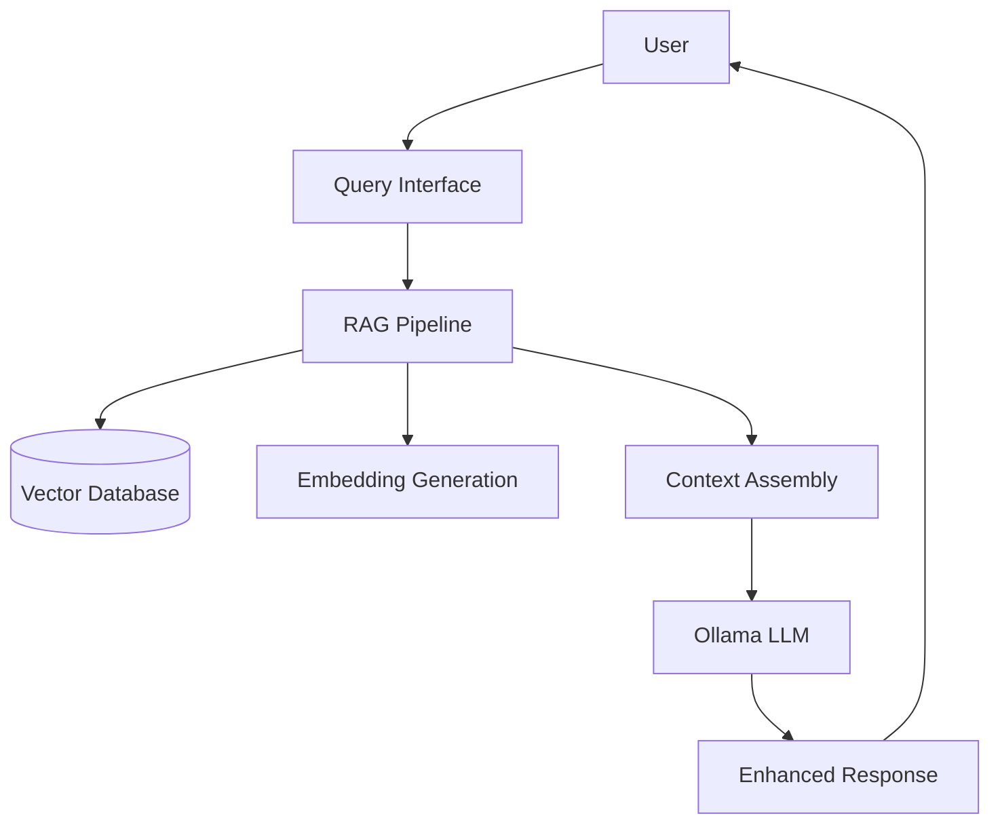

# Obelisk

Welcome to Obelisk - a powerful Obsidian vault to MkDocs Material Theme converter with integrated AI capabilities.

---

**Categories**: documentation 📚 • knowledge base 🧠 • AI integration 🤖 • RAG system 🔍

---

## Overview

Obelisk transforms Obsidian vaults into beautifully rendered static sites using MkDocs with the Material theme. It offers a complete documentation solution with built-in AI-powered search and chat capabilities through Retrieval Augmented Generation (RAG).

!!! tip "Complete Documentation Platform"
    Obelisk is more than just a converter - it's a complete documentation platform with AI assistance built in.

## Key Features

- **Seamless Obsidian Conversion**: Preserves Obsidian's rich features in your MkDocs site
- **Integrated RAG Pipeline**: Enables AI to answer questions directly from your documentation
- **Material Theme Integration**: Beautiful, responsive, and feature-rich documentation
- **AI Chatbot**: Connect with Ollama and Open WebUI for context-aware answers
- **Docker Orchestration**: One-command deployment of the entire stack
- **Customization Options**: Extensive styling and theming capabilities
- **Python-based Workflow**: Managed with Poetry for reproducible builds

## RAG System

Obelisk's RAG (Retrieval Augmented Generation) system connects your documentation directly to AI models:



The RAG pipeline:
1. Processes your documentation into searchable chunks
2. Generates vector embeddings for semantic search
3. Retrieves relevant content based on user queries
4. Feeds this context to an LLM through Ollama
5. Returns accurate, contextual responses based on your content

## Quick Start

=== "Using Docker (Recommended)"

    ```bash
    # Clone the repository
    git clone https://github.com/usrbinkat/obelisk.git
    cd obelisk
    
    # Start all services (docs, Ollama, Open WebUI)
    docker-compose up
    
    # Access documentation at http://localhost:8000
    # Access AI chatbot at http://localhost:8080
    ```

=== "Using Poetry"

    ```bash
    # Clone the repository
    git clone https://github.com/usrbinkat/obelisk.git
    cd obelisk
    
    # Install dependencies
    poetry install
    
    # Start the documentation server
    poetry run mkdocs serve
    
    # In a separate terminal, set up the RAG system
    poetry run obelisk-rag index
    poetry run obelisk-rag serve --watch
    ```

## AI Integration

Obelisk provides a complete AI integration stack:

1. **Ollama**: Serves optimized LLMs locally (llama3, mistral, phi, etc.)
2. **Open WebUI**: Provides a user-friendly chat interface
3. **RAG System**: Connects your documentation content to AI responses

To get started with the AI features:

```bash
# Start the full stack with Docker
docker-compose up

# Pull recommended models
docker exec -it ollama ollama pull llama3
docker exec -it ollama ollama pull mxbai-embed-large

# Index your documentation
docker exec -it obelisk obelisk-rag index
```

## Customization

Obelisk supports extensive customization options:

- [CSS Styling](customization/css/index.md) - Custom themes and styles
- [JavaScript Enhancements](customization/javascript/index.md) - Interactive features
- [HTML Templates](customization/html/index.md) - Layout customization
- [Python Extensions](customization/python/index.md) - Extend functionality
- [Versioning](customization/versioning/index.md) - Documentation versioning

## Development

Obelisk uses modern development tools and practices:

- **Task Runner**: Simplified commands via [Taskfile.yaml](development/task-runner.md)
- **Docker Support**: Containerized development and deployment
- **EditorConfig**: Consistent coding styles
- **Poetry**: Dependency management and packaging
- **MkDocs**: Documentation generation with Material theme

For more information, see the [Development Guide](development/index.md).

## Documentation

Explore our comprehensive documentation:
- [Chatbot Integration](chatbot/index.md) - AI chat setup and configuration
- [RAG System](chatbot/rag/getting-started.md) - Retrieval Augmented Generation details
- [Customization](customization/index.md) - Styling and theming options
- [Development](development/index.md) - Developer guides and references